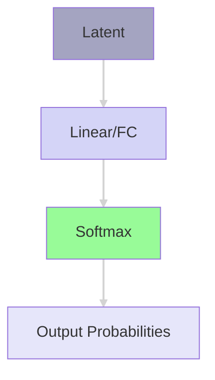

# preface

This project was a joint-effort between me (spuun) and my team (wew, po) on the transfer learning of the diffusion language model LLaDA as part of KCV's Lab Admin Open Recruitment.

Check out the Indonesian version [**here**](./lada-id), it's written by my teammates, wew and po, so you're gona see a bit of a discrepancy in the writing styles (and maybe some materials, I haven't completely done the fact-checking ehehe), you can kinda see my post as the "canonical", whilst the other one is a "distilled" version off my teammates' understanding.

# **wat, llms?**

> Yeah no, there's no way u dunno abt generative LLMs at this point man, u been living under a rock?

... anyway, so let's start of with what this thing's abt, an introductions, what LlaDA even is, what methods we're using, yadda yadda. To start things off, esp for those in the back who don't know abt these (somehow), let's go with a brief explainer to jog our memory on generative LLMs.

## **autoregressive language modelling**

When we talk about generative language modelling—— speaking of which, I highly recommend for you to check out [my previous post](../seq2seq-re#approaches) on my experiments with Reverse Engineering (RE) with LLMs, where I went thru some handwaving on the theory of the modern approach w/ transformer-based LLMs—— the commonly-used approach in the current state of this space is that we usually do things <u>autoregressively</u>.

This is because the model that we use in this space, generative language modelling, are `decoder-only` models. Where they're only using the decoder component of a traditional transformer `encoder-decoder` architecture (where, if you're familiar w/ that infamous "Attention Is All You Need" [@NIPS2017_3f5ee243] paper? Yeah, that's what they proposed in there). 

The reasoning here is that, the decoder is really the only generative part in a model like this, the encoder itself really just provides some level of "residuality" which connects the whole latent w/ the current generational process, but both can, in a way, be used to model the same processes... Mmm... man my brain b wacky todat... we're getting sidetracked, anyway, we'll come back to this down below, this is a bit of a spoilers.

Anywho, "autoregressively" as in? Well, to make it quick for you, here's a demo I had before (do ignore the sample lmoa), try hovering over each word:  

<figure>
<iframe src="https://editor.p5js.org/spuuntries/full/1uDMq_cwh" style="width: 100%; height: 300px"></iframe>
<figcaption>Here's a visual I did with a bit of p5.js and claude, masked self-attn.</figcaption>
</figure>

When we do language modelling with self-attention autoregressively, we apply what's called `masked self-attention`. This variant of self-attention is basically the same as the same old self-attention that we're already used to, but the attention computation is only done on itself and the prior inputs in the sequence. You can see this phenomenon by hovering over each word in the sequence above.

That "itself-to-itself-and-everyone-before" is because of the fact that causal language modelling usually has to do its modelling over a cause-effect assumption, hence "causal", where the next token is caused by prior inputs in the causality sequence. Kinda why we can somewhat assume a $P(X_i)$ is $P(X_i|X_{i-1})$ in markovian modelling (read: [Markov Property](https://en.wikipedia.org/wiki/Markov_property)), where $X_i$ inherently depends on the $X_{i-1}$, which means that, really, to get to an $X_i$, one can, for the most part, reduce it down to that chaining approach in a Markov chain. 

> (...although this is really just a convention tbh, as this is really just the most intuitive/tractable way of viewing it, and we'll go over why not in a bit down below)

To do a prediction, therefore, one would get the output logits of the next token by computing the score of a "hypothetical" token with respect to the rest of the inputs which has been processed, which is then shoved into an FC to get the final logits. I.e., say, given the following tokenized input (with the assumption of a basic word-by-word tokenization method):

```py
Positions:    [0,    1,    2,    3,     4,    5,    6]
Tokens:      ["I", "love", "femboys", "->", "J'", "aime", "les"]
```

To predict, we do the attn computation on some "hypothetical" placeholder token at position 7, with self-attn relationship computed with respect to tokens 0-6 (and ofc, itself). 


<figcaption>So from hidden dims of the latent, it goes into an FC (a linear layer), so we have output logits at vocab_len dims, then a normalization layer</figcaption>

After which, as you can see up there, it's shoved into an FC head at size of the vocab, which then gets logits, then softmax (or some other normalization shid you got) to get the probdist. ...So smth like:  

```py
{
    # Where "Tokens": Prob
    "Femboys": 0.5,
    "Girls": 0.3,
    "Guys": 0.1,
    "Humans": 0.05,
    "Cats": 0.01,
    # ... think like, some tens to hundreds of thousands more down here lmao
}
```

(Ofc, assuming we've alrd mapped the IDs back to the tokens themselves, yadda yadda)

### wat rong?

> ...So, mmm, what's wrong w/ this approach?

You may be asking.

... well, for one, honestly? Nothing. 

Again, this is just one of the ways we can model language, and as with most things relating to the idea of modelling a phenomena in science, nothing is necessarily, inherently, "wrong", in modelling something. 

It's really just all about what evidence there is to back each modelling approach, and how well and intuitively it "clicks" with the interpretation of the domain itself.

However, there _is_, indeed, a reason, why I said up there that there are some "caveats" to this. 

Let's go over a nice little "example", it's a bit handwavy, but def not a first in this blog lol. In a previous experiment I did for KCV's assignment (which I'lll... make a post on too, I promise! Pls look forward to it 🥺)— of which, ig I'll just link it here too lol [why not](https://colab.research.google.com/drive/1cwkZ7ggDFLH6YDmUdxt02-0zcmcDfkOc?usp=sharing), I've alrd promised since last post anw—

... say— mmmh... ykno what I'm just gonna copy over my thing from the notebook— 

> if we'd used self-attention (assuming the most textbook implementation of this, not assuming sparsity, or flash attention, yadda yadda), the idea was that each of the words compute their "relationship" scores (i.e., attention score) with respect to one another and themselves.  
> 
> Why? A neat visual I had a while ago that I thought up of was the use case for coref resolution. If we'd used the above sentence, here's what we might see, say we omit the words which has the lower end of the scores, and then highlighting the `lamb`'s computed scores, we'll see that
> 
> `__ __ lamb __ breakfast __. It __ __.`
> 
> The words `lamb`, `breakfast`, and `It` will naturally have higher scores compared to the others, because they relate very strongly to one another (especially if you're viewing it from the context of the `lamb`). This, in turn, can be used to determine which words refer to which thing, so, say we swap it out like this,
> 
> `__ __ lamb __ lamb __. lamb __ __.`
> 
> Overall, _technically_, semantically, this still conveyed that idea of me having had lamb. (Ofc, this isn't, like, technically, syntactically/grammatically correct, but, ygwim).

Digested? Okay, well, interestingly, ... let's take another one for coref,   

> Because he was feelin ADHD af, Astolfo went to scroll reels all night

If we were to do the same computation up there in the quoted bits, this'd work fine, the "he" in this sequence would show fine. However, if you went ahead and tried doing **masked** self-attn on it, a problem arises. 

<figure>
<iframe src="https://editor.p5js.org/spuuntries/full/HCpkZoWjU" style="width: 100%; height: 500px"></iframe>
<figcaption>Btw whipped up a demo for the above.</figcaption>
</figure>

How would the model create a connection from "he" to "Astolfo" here? The coreference resolution can only go backwards, not forwards, and therefore, unless the model has inherently assumed a "he" to be there (i.e., statistically-significant), there's no practical reason for there to be a possibility of a stochastic prediction to fall on "he", if anything the token of "Astolfo", a nominal subject, will basically always precede its replacement counterpart. This is where that left-to-right "causality" breaks down. Turns out, causality *can* go forward.

Of course, this assumes that you can't for whatever reason move the forward relation *into* the "digested" window, effectively folding and collapsing the forward dependency backwards, but that's beside the point, for cases which *do* demand such a frame, the autoregressive approach will, indeed, break down.

## ...so both ways?

Yis! GO BOTH WAYS. That, is indeed, the "fix" for that "flaw" in the modelling. This, in fact, is why we do encoder-decoder. Encoders, do a full self-attention computation, which then gets shoved into the decoder as part of a sort of... "residual" latent connection via the cross-attn.


This ensures that to model that forward dependency, we don't have to first fold and collapse it down. This, in turn, allows for a lower level of dilution in the causality of the sequence, at the cost of having worse asymptotic complexity.

... hmmm, so bad bad, yeah? Mhm, I mean, think abt it, just to get there, we'd have to shove three attention mechanisms, one from the encoder, one from the cross attn, and one from the decoder. In fact, this whole thing is the reason why this scheme would never have really worked out for generative modelling, processing is just, too much for it to work out.

## ... confus, y not autoregressive, then, again?

Well, for one, autoregressive modelling, *does*, again, work. I'm not saying that you can't model linguistics autoregressively, it's just that this model has some inherent "flaws" that it just, can't address, without assuming "transforms" done on the input (i.e., that "folding").

We need a method which considers the whole of the input and the "output" sequence, that is, we sort of... predict, the *whole* future window at some $X_n$ with $n$ tokens, in order to allow for it to hold that forward dependency. But how? How would one allow the prediction of future tokens, ... basically at the same time, for the entire window...?

... so what am "I" proposing? Well, let's see... let's talk abt diffusion models. :skull:

# wait wtf— DIFFUSION?? :kms:

Mhm, mhm, diffusion lmoa. Yeah no I'm not happy either man, the maths rlly suck here. I'm gonna go a bit extra handwavy here because I don't wanna do all the proofing, and Idt that you'd be there to read thru me yap abt KL divergence and allat ykno. :moyai: 

Anyway, when we talk about diffusion models, I think the first thing that comes to mind, methinks, is prolly image gen models, right?

Let's briefly go over what diffusion models, are. 

In image gen modelling, we can view diffusion models as... well, honestly? "Just" denoising models. Why? let's take this diagram I snipped off from Binxu Wang's [material](https://scholar.harvard.edu/binxuw/classes/machine-learning-scratch/materials/foundation-diffusion-generative-models) :3


If you look up there, skipping over the compression part into latent and all that, *just* the diffusion, all that "diffusion"  really is, is just both the adding and removal of noise within a given input (although ofc there are some caveats to this as well, we can model as moving the dist, yadda yadda, but I'm spiralling bruh :kms:). 

What means? Mmm, I don't wanna get into the weeds of how this can be modelled in different ways... The maths get... mmm, brain hurty sad sad iygwim :CC 

... Really, all you need to understand here, is that, for a given input $x_i$, what we call the timestep, one must be able to correlate it with the $x_{i+1}$, via some modification, of which all are at size of $x$.

So this is basically what we needed! We can reframe the window we need to predict as part of the $x$ itself, but have the input be locked (i.e., only "diffuse" in the window, but take in the whole of $x$ as input). 

OMG Wait, "brain confus"? "Wtf, how u got there, you movin too fast"? Yeah I feel you, me tryna cut time man, ain't no one reading this whole thing, we haven't even gotten to the training process. :pepehands: 

### diffusion language modelling?

Anyway, well, here's how we can view this. Think about it like this, say given the input of 

> Because he was feelin ADHD af,

We wanna predict the whole of `Because he was feelin ADHD af, Astolfo went to scroll reels all night`, *buuut* still keep that forward dependency relation which we went over up there.

Here, we can view the "entirety" of the $x$ as the input + some allocated "budget" which is at least at the size of window which we want to predict with the bidirectional dependency. 

... seems straightforward enough, so why not shove a U-Net in there to do "denoising" on a language input, then? Well, mainly, two problems:
1. <u>The usual way we do things for language modelling,</u> where we assign some arbitrary units we call "tokens" to process things, is inherently discretized. What do I mean? 

    Well, look at it simply like how tokens can't just, change in-between states, as in, well, say I had `femboy` as a predicted thing, it can't just, be in-between of `femboy` and `female`, assuming, say, like, they're ID'd at `0` and `1`, add `0.5` to an input of `0`, take the middle ground of some... `0.5`, `femole` or smth, ykno. It's gotta be one or the other token. In contrast, in image or audio or other continuous domains, we can occupy a space between the numbers, hence the "continuity", this allows the flexibility when we modify the inputs during diffusion.
 
2. <u>What'd "noise" even ***BE*** in language modelling?</u> What, typos? LMOA, yeah no, imho, there really isn't a great intuitive way of interpreting it. The reason why noise inherently works in the image domain, is that noise, in and of itself genuinely does model the "movement" of the data distribution in images (and audio), there isn't really a good way of interpreting noise in this domain that goes "bidirectionally". 

   Tying to the previous one, "noise" like typos model the destruction of input, but it inherently assumes that the "destruction" are therefore then modelled at the token-level, here, you can't really start from gibberish then typo your way into coherency when your space doesn't 1-to-1 align to your tokenization space. (`femboy` = `fem` + `boy`, but `female` = `fe` + `male`, can't modify `fem` into a `female` from a "typo") But this is a discussion for another day, I think there's definitely an argument to be had here tbf, but I'm tired, my team's tired, needa collect ts tonight, so I digress. 

<u>... So solution?</u> Well, one way is to just, ignore the second problem, allow for token-level "noise" schedule, *and* just, reframe the "noise" schedule as being applied across the entire sequence, i.e., where only some number of "noised" tokens within the budget window is then "decoded", creating "noise" in the input sequence, yet still staying within that discretized constraint.

This, finally, in fact, is what LlaDA [@nie2025largelanguagediffusionmodels], the model we're working with, has chosen to do. Wat? See the following demo.

<figure>
<iframe src="https://editor.p5js.org/spuuntries/full/VSLTwoDgk" style="width: 100%; height: 300px"></iframe>
<figcaption>Here's a visual of how the "diffusion" process goes.</figcaption>
</figure>

In order to allow for the described behaviour above, during pretraining, we "mask" some number of tokens, *then*, we train the model to understand which tokens to "unmask" given some input with masked tokens. 


During inference, the "unmasking" process here, is really just that the allocated "budget" tokens are all masked tokens, where the ones actually processed for decoding are the ones "unmasked", some top $k$ prediction logits (where they're most certain) are unmasked, where the rest are "re-masked" for future timesteps. 

This means that LlaDA, essentially, almost basically just functions as an encoder model, where the self-attn processed is a full sequence-to-sequence self-attn computation. *This* is what allows that forward dependency.

A nice possible upside to doing modelling like this, is that the loss of forward dependency in autoregressive models have basically led models to fail during Chain-of-Thoughts (CoT) [@NEURIPS2022_9d560961] once it's committed to a single wrong step in the flow to an answer (as every $x_i$ depends on $x_{i-1}$), can be inhibited, without having to introduce an intermediary state to "interrupt" the model's thinking process (a la modern thinking models like Deepseek's R1 [@deepseekai2025deepseekr1incentivizingreasoningcapability]), or having to aggregate (a la Self-Consistency [@wang2023selfconsistency]), it inherently holds an understanding of what it'll do in the future and can inhibit itself as it decodes the window.

# transfer learning

... sooooooo, transfer learning. Transfer learning is basically this idea of training a pretrained model on a new domain which may (or may not!) have some relationship with its original domain, essentially just primarily relying on its preexisting knowledge to be transferable to the learning of the new domain. [@9134370]

Anyway, for my team's research, we did what's called cross-lingual transfer learning, which, well, honestly, it's in the name, it's the practice of transferring a language model's knowledge on a language such that it'd work better in another language. We did transfer learning from LlaDA's primary domain, that is non-Indonesian language, to Indonesian. There's been a good amt of precedence behind this, 

Anywho, to do this, there are lots of ways, you can add a new head, you can tune an adapter at the input, an encoder, yadda yadda, there's a lot here. But I think one that we're already pretty much familiar with, and is basically probably the first thing that *anyone* would think of first when we do this, is <u>finetuning</u>. 

Finetuning, in short, can be boiled down to that idea of training weights to work with the dataset, it's literally just doing training lol. When we're talking abt models like CV models, this isn't really that big of an issue, they're like, what millions of parameters, tops? **HOWEVER, issue?** LLMs literally could ***NOT*** be any further away from that reality lol. 

We're talking **BILLIONs** of parameters, trillions for some models too nowadays tbh, and this gets... obv, very wacky. These days, basically no one can train these ginormous models w/o having some amt of significant budget that they can allocate to this.

Solution? Parameter-efficient Finetuning.

# Parameter-Efficient Finetuning (PEFT)

Parameter-Efficient Finetuning, PEFT, in short, is the practice of *not* training all the parameters, and instead, do the modification only on *some* components of the model. 

Like transfer learning, there are many ways to accomplish this [@han2024parameterefficient], in fact, here's one I found in a paper a while ago [@lialin2024scalingscaleupguide]:


For time efficiency we're gonna skip a bit, and just say that we're working w/ LoRA.

## LoRA?

Yes, LoRA. Wtf is LoRA? LoRA stands for `Low-Rank Adaptation` [@hu2022lora], which, okay, there's a lot of theory to go over here, but I had from last semester's final project (yeah, the one I mentioned I submitted for publishing from last post, it's at minor revisions stage btw, gona edit this post too if it gets accepted in the future) that explains this pretty well, so I'm just gonna copy off that.

> Low-Rank Adaptation (LoRA) was a method introduced by Hu et al. (2022) of Microsoft, which proposes to... well, let's start with the diagram actually, kinda hard to intuit without a visual:  
>
>   
>
> Let's start with the basics, when we do backprop on weights, we have to do a backprop on the weights matrix, right? Now, the problem with this, is that, if we have a ***LOT*** of weights, this quickly gets *very, very,* impractical. What Hu et al. proposes is that, we can approximate this backprop change to the matrix with a low-rank decomposition matrix.  
> 
> Wtf is that? Idk how to explain it exactly, but basically we try to approximate/represent some larger matrix with smaller ones, α and β (we'll just refer to them as A and B to make it easier on me lol), at size rank r.
> 
> Let me show you a quick example, say we have this $\Delta$ on the weights when we calculate it by the usual backprop method:  
> ```
> [[1, 2, 3, 4],
>  [2, 4, 6, 8],
>  [3, 6, 9, 12],
>  [4, 8, 12, 16]]
> ```
> This, if you notice, is basically just,
> `[1, 2, 3, 4]` when $\otimes$ (outer product) to
> ```
> [[1],
>  [2],
>  [3],
>  [4]]
> ```
> right?
> 
> So that's what a low-rank approximation looks like for r=1. Where,
> A = `[1, 2, 3, 4]`
> and
> B =
> ```
> [[1],
>  [2],
>  [3],
>  [4]]
> ```
> 
> We optimize A and B such that when $A \otimes B$, we get as close as an approximation as possible to the actual backpropped $\Delta$ on the weights.
> 
> (P.s., there *is* another thing that I'm gonna skip here, which is LoRA rank-stabilization, but for the sake of my sanity, and maybe even yours, you can just, read up on Kalajdzievski, D. (2023) from Tenyx lol)

(There are also some assumptions there, since we're working with self-attn, such it's dxd for the $W$, it'd generalize to a dxk matrix, but the gist of it is in there fwiw.)

## LoRA+

Same deal, I need to collect this by tonight bruh :kms: so we're gonna copy off the notebook again,

> Okay, whew, now that you're up to speed to LoRA, we're moving to LoRA+ :kms: This was introduced by Hayou et al. (2024), and I'm not gonna go over the maths again for the sake of my sanity :plsgodno: so but, basically, this is what we went over up there, but for LoRA+, we track two different learning rates for A and B, where B's LR is λ times that of A, this, according to their results, got faster convergence rates compared to the base LoRA.
> 
> There you go! You're basically up to speed with our methodology now lmao.

## PiSSA

~I'm gonna kms--~ Okay, so PiSSA [@meng2025pissaprincipalsingularvalues], to make this quicker for the both of us ~and keep my sanity~, the way you can view this is that...

Let's see, in initializing the LoRA weights for both of A and B, there really isn't that much guidelines as to how one'd go abt doing it. Usually, as per the usual w/ weight init, we set up via gaussian over A and zeros on B, tho, according to PiSSA, this is actually not necessary.

Look at it like this, if we already have some number of pretrained parameters we can work off of, why not obtain some approximation of where we're starting from? Here, PiSSA proposes the use of Singular Value Decomposition (SVD) to get a matrix which essentially is a reduction of the initial $W$ matrix.

Here, to do the decomposition, there are different ways, but generally speaking, as per any reduction technique, it gets pretty slow as your input scales up. Here, you can basically restrict the number of iterations which it uses to reduce the initial matrix, applied via a fast SVD method.

# OMG TRAINING FINALLY YES ASJNDJKASBDASD 😳😳😳

WE'RE FINALLY AT THE ACTUAL THING LMFAO, TOOK A WHILE, BUT WE HERE, FINALLY. ~I'M GONNA KMS AJSDNASJKDB~

## data curation

So to do data curation, we sampled off the Cendol Collections [@cahyawijaya-etal-2024-cendol] dataset, via the following procedure, :  
  1. Grab the subsets of data from Cendol Collection which contains Indonesian only, this includes the following subsets: `indo_puisi, wikihow, wikipedia_id, safety_prompt, identity_prompt, and dolly`.  

        The rationale behind this was to accelerate the convergence rate, considering that later on we'll be using LoRA to add additional parameters that won't be able to learn significantly different domains from the base domain (otherwise it'd have to very much overfit), as such Indonesian would be closer to English than, say, Maduranese or Javanese.  

        This results in a $\approx 50\%$ reduction in the sample size, so $\approx 6 \text{ million}$ samples from the initial 12 million provided from Cendol Collection.
  2. Sample from those subsets for a $3\%$ sample via stratified sampling on `template_names`, getting us some $\approx196 \text{ thousand}$ samples. 
  
        The rationale behind this was to effectively represent each subset in the next step, as each `template_names` here represent a tighter scope within each subset (i.e., we wanna ensure a wider variability by allowing a more diverse sample set, hence allowing `template_names` as there are more of those).
  3. KMeans cluster the instances by embedding them with `IndoBERT-p1-cased` at K=10, grabbing for each cluster 1,000 samples and augmenting from other clusters if the current cluster has insufficient instances, resulting in a sample size totalling at 10,000 instances.  


## data prepro

To make it work with LlaDA, we shoved it thru some prepro to ensure that the formatting works out, this is especially because to do the tuning, this is essentially just Supervised Fine Tuning (SFT), and looking at the paper [@nie2025largelanguagediffusionmodels], it looks pretty standard, so we shoved it thru the same prepro as the one we had for the ML final project.

### **1. ShareGPT Formatting**

ShareGPT is a common format (it's kinda a general description of a set which uses "role" and "content" as keys) used in instruction training, here's our formatter function, we also run it thru Unsloth's formatter just to make sure.
Essentially, it goes smth like from this
```py
{'dataset_name': 'nusa_t2t_v2',
 'subset_name': 'wikipedia_id',
 'prompt_id': 'cd34b736-1ce0-48c1-b9ed-eab9342a419f',
 'template_name': 'wikipedia_subsection_4',
 'dataset_key': 'train',
 'input': 'Gw mau tau Komposisi dari HD 40307 g',
 'output': 'Penemu kode Hugh Jones, dari University of Hertfordshire di Inggris, menduga: "Orbit yang lebih panjang dari planet baru berarti bahwa iklim dan atmosfernya mungkin tepat untuk mendukung kehidupan."\n\n..."'}
```
to this
```py
[{'content': 'Gw mau tau Komposisi dari HD 40307 g', 'role': 'user'},
 {'content': 'Penemu kode Hugh Jones, dari University of Hertfordshire di Inggris, menduga: "Orbit yang lebih panjang dari planet baru berarti bahwa iklim dan atmosfernya mungkin tepat untuk mendukung kehidupan."\n\n..."',
 'role': 'assistant'}]
 ```

### **2. Llama 3.1 Formatting**

Since LlaDA uses an adapted Llama tokenizer, we have to conform the format to their instruction tuning format in order to ensure convergence (since otherwise the adapter later on would have to do some ***very*** heavy lifting to work with a new format).

This turns the
```py
[{'content': 'Gw mau tau Komposisi dari HD 40307 g', 'role': 'user'},
 {'content': 'Penemu kode Hugh Jones, dari University of Hertfordshire di Inggris, menduga: "Orbit yang lebih panjang dari planet baru berarti bahwa iklim dan atmosfernya mungkin tepat untuk mendukung kehidupan."\n\n..."',
 'role': 'assistant'}]
```
into
```code
<|begin_of_text|><|start_header_id|>system<|end_header_id|>\n\nCutting Knowledge Date: December 2023\nToday Date: 26 July 2024\n\n<|eot_id|><|start_header_id|>user<|end_header_id|>\n\nGw mau tau Komposisi dari HD 40307 g<|eot_id|><|start_header_id|>assistant<|end_header_id|>\n\nPenemu kode Hugh Jones, dari University of Hertfordshire di Inggris, menduga: "Orbit yang lebih panjang dari planet baru berarti bahwa iklim dan atmosfernya mungkin tepat untuk mendukung kehidupan."\n\n...<|eot_id|>
```

### **3. Tokenization**

Tokenization of the prompts, so turning  
```code
<|begin_of_text|><|start_header_id|>system<|end_header_id|>\n\nCutting Knowledge Date: December 2023\nToday Date: 26 July 2024\n\n<|eot_id|><|start_header_id|>user<|end_header_id|>\n\nGw mau tau Komposisi dari HD 40307 g<|eot_id|><|start_header_id|>assistant<|end_header_id|>\n\nPenemu kode Hugh Jones, dari University of Hertfordshire di Inggris, menduga: "Orbit yang lebih panjang dari planet baru berarti bahwa iklim dan atmosfernya mungkin tepat untuk mendukung kehidupan."\n\n...<|eot_id|>
```
into  
```code
tensor([128000, 128000, 128006, 9125, 128007, 271,  38766, 1303,  33025,  2696, 25, 6790, 220, 2366, 18, 198, 15724, 2696,  25, 220, 1627, 5887, 220, 2366, 19, 271, 128009, 128006,    882, 128007, 271, 51, 337, 647,  86088,  79451, ...], device='cuda:0')
```

### **4. Train on Responses Only**

This is pretty intuitive, basically, our training focuses on the augmentation on how the model responds to user input, therefore, we have to "mask" out parts of the prompt that's irrelevant to that (since we don't need the model knowing how to make inputs lol). We mask it out with -100 on the irrelevant portions, which basically turns (assuming tokenized) this
```code
tensor([128000, 128000, 128006, 9125, 128007, 271,  38766, 1303,  33025,  2696, 25, 6790, 220, 2366, 18, 198, 15724, 2696,  25, 220, 1627, 5887, 220, 2366, 19, 271, 128009, 128006,    882, 128007, 271, 51, 337, 647,  86088,  79451, ...], device='cuda:0')
```
to
```code
tensor([-100,   -100,   -100,   -100,   -100,   -100,   -100,   -100,   -100,
          -100,   -100,   -100,   -100, ..., -100,   -100,   -100,   -100,
          -100,   -100,   -100,   -100,   -100,   -100,   -100,   -100,   -100,
          -100,   -100,   -100,   -100,   -100,   -100,    271,  84583,   2857,
         74976,  74529,   5230,    718,  55679,    869,    258,  31475,   1208,
         30728,    220,    966,  92033,    220,  ...], device='cuda:0')
```
this will later then be interpreted by the model as an attention mask, and anything that's -100 is basically excluded from its training, so smth like (where 0 is the masked out portion and not trained on.)
```code
tensor([0, 0, 0, 0, 0, 0, 0, 0, 0, 0, 0, 0, 0, 0, ..., 1, 1, 1, 1, 1, 1, ..., 0, 0, 0, 0, ...], device='cuda:0')
```  


This is also to follow the SFT schema provided by the LlaDA authors, where the "unmasking" is only done on the response. This makes sense, since the response is the budget window which we allocate for the model, so training for the prompt's loss would make no sense, the model doesn't need to understand how the prompt was constructed. This is different from pretraining, as during pretraining, we want to ensure it has a general sense of understanding regarding language modelling.  

## evaluation

In order to evaluate the performance of the model before and after the application of the adapters, we used 4 metrics, ROUGE, BLEU, METEOR, and F1.

Here:
1. ROUGE is used to evaluate the recall capabilities of the model, this is measured via the overlap between the reference and the generated texts. Wud be most useful wen we wanna consider using this for RAG, for example.
2. BLEU is used to determine the quality of the cross-lingual transfer, 

# results n discussion akjsdbaskjdbasjkd :skull:

Ogey, let's talk abt results nao. For ease of you viewing all of the tried methodology iterations which we used, you can refer to the following table:

<div style="overflow: scroll">
| No | Method | Archive | BATCH_SIZE | EPOCHS | LEARNING_RATE | CUTOFF_LEN | LORA_R | LORA_ALPHA | LORA_DROPOUT | VAL_SET_SIZE | Optimizer LoRa+ | lr (Optimizer LoRA+) | loraplus_lr_ratio |
|----|---------|-------|------------|--------|---------------|------------|---------|------------|--------------|--------------|-----------------|---------------------|-------------------|
| 1  | LoRa | [model](https://files.catbox.moe/mhfhrr.zip) | 2 | 3 | 2e-4 | 512 | 16 | 16 | 0.1 | 0.1 | N/A | N/A | N/A |
| 2  | LoRa | [model](https://files.catbox.moe/74dbvu.zip) | 2 | 3 | 2e-4 | 512 | 32 | 16 | 0.1 | 0.1 | N/A | N/A | N/A |
| 3  | LoRa | [model](https://files.catbox.moe/yew997.zip) | 2 | 3 | 2e-4 | 640 | 4 | 16 | 0.1 | 0.1 | N/A | N/A | N/A |
| 4  | LoRa | [model](https://files.catbox.moe/v3kv12.zip) | 2 | 3 | 5e-3 | 512 | 8 | 8 | 0.1 | 0.1 | N/A | N/A | N/A |
| 5  | LoRa | [model](https://files.catbox.moe/x4xze3.zip) | 2 | 3 | 2e-4 | 512 | 8 | 8 | 0.1 | 0.1 | N/A | N/A | N/A |
| 6  | LoRa | [model](https://files.catbox.moe/pafqos.zip) | 2 | 3 | 5e-4 | 512 | 16 | 16 | 0.1 | 0.1 | N/A | N/A | N/A |
| 7  | LoRa | [model](https://files.catbox.moe/jp9kgf.zip) | 2 | 3 | 2e-4 | 512 | 16 | 16 | 0.1 | 0.1 | N/A | N/A | N/A |
| 8  | LoRA+ and PiSSA (4 iter) | [model](https://files.catbox.moe/35ez0i.zip) | 2 | 3 | 2e-4 | 512 | 16 | 16 | 0.1 | 0.1 | bnb.optim.Adam8bit | 5e-5 | 16 |
| 9  | LoRA+ and PiSSA (8 iter) | [model](https://files.catbox.moe/93it3o.zip) | 2 | 3 | 2e-4 | 512 | 16 | 16 | 0.1 | 0.1 | bnb.optim.Adam8bit | 5e-5 | 16 |
</div>

All in all, the metrics looked pretty good, here's a plotting of the average metrics of the adapters compared to the baseline:


Though, when we look more closely to the data here, methinks we have quite a good amt to be desired still, here's the percentage improvement for each adapter,


See that high improvement from adapter 4 in basically all the metrics, but literally going to the negative in ROUGE-2? Yeah that's weird.

In practice, we see that the model highly deviates from coherency, and barely forms any coherent outputs. We believe that due to the N-gram nature of many of these metrics, they've been "fooled" by the model to interpret its outputs as better than what they actually are.

Based on the above considerations, we pick out **adapter 1** and **adapter 5** as the two adapters which we believe performed the best with respect to its statistical deviance, the two does show 

## conclusions

As we can see up there, PEFT *does* work in the usecase of cross-lingual transfer learning of a generative LLM. However,

# future works

From here, we do suggest further exploration in the increase of 

# personal remarks

----

Bibliography: