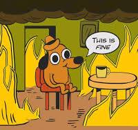
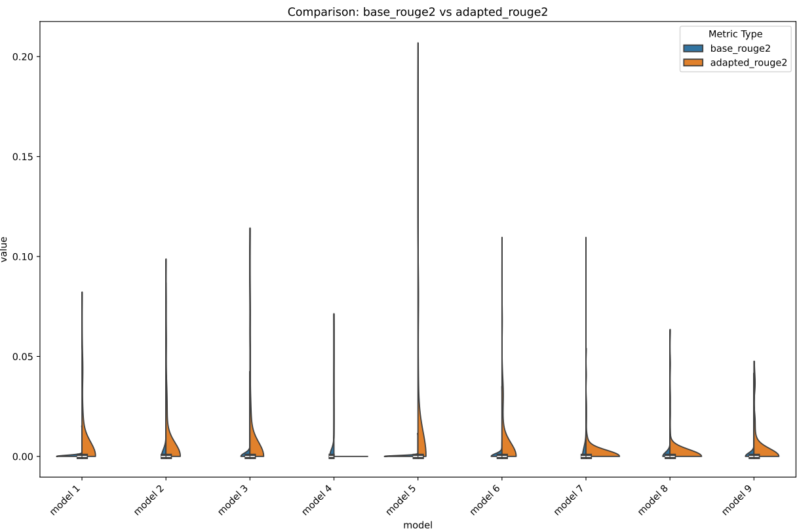

# preface

This project was a joint-effort between me (spuun) and my team (wew, po) on the transfer learning of the diffusion language model LLaDA as part of KCV's Lab Admin Open Recruitment.

Check out the Indonesian version [**here**](./lada-id), it's written by my teammates, wew and po, so you're gona see a bit of a discrepancy in the writing styles (and maybe some materials, I haven't completely done the fact-checking ehehe), you can kinda see my post as the "canonical", whilst the other one is a "distilled" version off my teammates' understanding.

Check out our runs at this [documentation notebook](https://github.com/spuuntries/geg-blog/tree/main/src/content/blog/llada-peft/notebook%20docs).

<a target="_blank" href="https://colab.research.google.com/drive/1IQhFdOzYPGez6PNInMB_6z9Lg2yTkzxM?usp=sharing">
  
</a>

View the deployment [here.](https://huggingface.co/spaces/spuun/llada-8b-kcv)

# **wat, llms?**

> Yeah no, there's no way u dunno abt generative LLMs at this point man, u been living under a rock?

... anyway, so let's start of with what this thing's abt, an introductions, what LlaDA even is, what methods we're using, yadda yadda. To start things off, esp for those in the back who don't know abt these (somehow), let's go with a brief explainer to jog our memory on generative LLMs.

## **autoregressive language modelling**

When we talk about generative language modelling—— speaking of which, I highly recommend for you to check out [my previous post](../seq2seq-re#approaches) on my experiments with Reverse Engineering (RE) with LLMs, where I went thru some handwaving on the theory of the modern approach w/ transformer-based LLMs—— the commonly-used approach in the current state of this space is that we usually do things <u>autoregressively</u>.

This is because the model that we use in this space, generative language modelling, are `decoder-only` models. Where they're only using the decoder component of a traditional transformer `encoder-decoder` architecture (where, if you're familiar w/ that infamous "Attention Is All You Need" [@NIPS2017_3f5ee243] paper? Yeah, that's what they proposed in there). 

The reasoning here is that, the decoder is really the only generative part in a model like this, the encoder itself really just provides some level of "residuality" which connects the whole latent w/ the current generational process, but both can, in a way, be used to model the same processes... Mmm... man my brain b wacky today... we're getting sidetracked, anyway, we'll come back to this down below, this is a bit of a spoilers.

Anywho, "autoregressively" as in? Well, to make it quick for you, here's a demo I had before (do ignore the sample lmoa), try hovering over each word:  

<figure>
<iframe src="https://editor.p5js.org/spuuntries/full/1uDMq_cwh" style="width: 100%; height: 300px"></iframe>
<figcaption>Here's a visual I did with a bit of p5.js and claude, masked self-attn.</figcaption>
</figure>

When we do language modelling with self-attention autoregressively, we apply what's called `masked self-attention`. This variant of self-attention is basically the same as the same old self-attention that we're already used to, but the attention computation is only done on itself and the prior inputs in the sequence. You can see this phenomenon by hovering over each word in the sequence above.

That "itself-to-itself-and-everyone-before" is because of the fact that causal language modelling usually has to do its modelling over a cause-effect assumption, hence "causal", where the next token is caused by prior inputs in the causality sequence. Kinda why we can somewhat assume a $P(X_i)$ is $P(X_i|X_{i-1})$ in markovian modelling (read: [Markov Property](https://en.wikipedia.org/wiki/Markov_property)), where $X_i$ inherently depends on the $X_{i-1}$, which means that, really, to get to an $X_i$, one can, for the most part, reduce it down to that chaining approach in a Markov chain. 

> (...although this is really just a convention tbh, as this is really just the most intuitive/tractable way of viewing it, and we'll go over why not in a bit down below)

To do a prediction, therefore, one would get the output logits of the next token by computing the score of a "hypothetical" token with respect to the rest of the inputs which has been processed, which is then shoved into an FC to get the final logits. I.e., say, given the following tokenized input (with the assumption of a basic word-by-word tokenization method):

```py
Positions:    [0,    1,    2,    3,     4,    5,    6]
Tokens:      ["I", "love", "femboys", "->", "J'", "aime", "les"]
```

To predict some token at position 7, we run a self-attn relationship computation to tokens 0-6 (and ofc, themselves for each).


<figcaption>So from hidden dims of the latent, it goes into an FC (a linear layer), so we have output logits at vocab_len dims, then a normalization layer</figcaption>

After which, as you can see up there, it's (the latest latent state) shoved into an FC head at size of the vocab, which then gets logits, then softmax (or some other normalization shid you got) to get the probdist. ...So smth like:  

```py
{
    # Where "Tokens": Prob
    "Femboys": 0.5,
    "Girls": 0.3,
    "Guys": 0.1,
    "Humans": 0.05,
    "Cats": 0.01,
    # ... think like, some tens to hundreds of thousands more down here lmao
}
```

(Ofc, assuming we've alrd mapped the IDs back to the tokens themselves, yadda yadda)

### wat rong?

> ...So, mmm, what's wrong w/ this approach?

You may be asking.

... well, for one, honestly? Nothing. 

Again, this is just one of the ways we can model language, and as with most things relating to the idea of modelling a phenomenon in science, nothing is necessarily, inherently, "wrong", in modelling something. 

It's really just all about what evidence there is to back each modelling approach, and how well and intuitively it "clicks" with the interpretation of the domain itself.

However, there _is_, indeed, a reason, why I said up there that there are some "caveats" to this. 

Let's go over a nice little "example", it's a bit handwavy, but def not a first in this blog lol. In a previous experiment I did for KCV's assignment (which I'lll... make a post on too, I promise! Pls look forward to it 🥺)— of which, ig I'll just link it here too lol [why not](https://colab.research.google.com/drive/1cwkZ7ggDFLH6YDmUdxt02-0zcmcDfkOc?usp=sharing), I've alrd promised since last post anw—

... say— mmmh... ykno what I'm just gonna copy over my thing from the notebook— 

>Say we took some sequence of words, and we try to compute the relationships of words with one another.
> 
> `I ate lamb for breakfast today. It was delicious.`
>
> if we'd used self-attention (assuming the most textbook implementation of this, not assuming sparsity, or flash attention, yadda yadda), the idea was that each of the words compute their "relationship" scores (i.e., attention score) with respect to one another and themselves.  
> 
> Why? A neat visual I had a while ago that I thought up of was the use case for coref resolution. If we'd used the above sentence, here's what we might see, say we omit the words which has the lower end of the scores, and then highlighting the `lamb`'s computed scores, we'll see that
> 
> `__ __ lamb __ breakfast __. It __ __.`
> 
> The words `lamb`, `breakfast`, and `It` will naturally have higher scores compared to the others, because they relate very strongly to one another (especially if you're viewing it from the context of the `lamb`). This, in turn, can be used to determine which words refer to which thing, so, say we swap it out like this,
> 
> `__ __ lamb __ lamb __. lamb __ __.`
> 
> Overall, _technically_, semantically, this still conveyed that idea of me having had lamb. (Ofc, this isn't, like, technically, syntactically/grammatically correct, but, ygwim).

Digested? Okay, well, interestingly, ... let's take another one for coref,   

> Because he was feelin ADHD af, Astolfo went to scroll reels all night

If we were to do the same computation up there in the quoted bits, this'd work fine, the "he" in this sequence would show fine. However, if you went ahead and tried doing **masked** self-attn on it, a problem arises. 

<figure>
<iframe src="https://editor.p5js.org/spuuntries/full/HCpkZoWjU" style="width: 100%; height: 500px"></iframe>
<figcaption>Btw whipped up a demo for the above.</figcaption>
</figure>

How would the model create a connection from "he" to "Astolfo" here? The coreference resolution can only go backwards, not forwards, and therefore, unless the model has inherently assumed a "he" to be there (i.e., statistically-significant), there's no practical reason for there to be a possibility of a stochastic prediction to fall on "he". If anything, the token of "Astolfo", a nominal subject, will basically always precede its replacement counterpart. This is where that left-to-right "causality" breaks down. Turns out, causality *can* go forward.

Of course, this assumes that you can't for whatever reason move the forward relation *into* the "digested" window, effectively folding and collapsing the forward dependency backwards, but that's beside the point, for cases which *do* demand such a frame, the autoregressive approach will, indeed, break down.

## ...so both ways?

Yis! GO BOTH WAYS. That, is indeed, the "fix" for that "flaw" in the modelling. This, in fact, is why we do encoder-decoder. Encoders, do a full self-attention computation, which then gets shoved into the decoder as part of a sort of... "residual" latent connection via the cross-attn.


This ensures that to model that forward dependency, we don't have to first fold and collapse it down. This, in turn, allows for a lower level of dilution in the causality of the sequence, at the cost of having worse asymptotic complexity.

... hmmm, so bad bad, yeah? Mhm, I mean, think abt it, just to get there, we'd have to shove three attention mechanisms, one from the encoder, one from the cross attn, and one from the decoder. In fact, this whole thing is the reason why this scheme would never have really worked out for generative modelling, processing is just, too much for it to work out.

## ... confus, y not autoregressive, then, again?

Well, for one, autoregressive modelling, *does*, again, work. I'm not saying that you can't model linguistics autoregressively, it's just that this model has some inherent "flaws" that it just, can't address, without assuming "transforms" done on the input (i.e., that "folding").

We need a method which considers the whole of the input and the "output" sequence, that is, we sort of... predict, the *whole* future window at some $X_n$ with $n$ tokens, in order to allow for it to hold that forward dependency. But how? How would one allow the prediction of future tokens, ... basically at the same time, for the entire window...?

... so what am "I" proposing? Well, let's see... let's talk abt diffusion models. :skull:

# wait wtf— DIFFUSION?? :kms:

Mhm, mhm, diffusion lmoa. Yeah no I'm not happy either man, the maths rlly suck here. I'm gonna go a bit extra handwavy here because I don't wanna do all the proofing, and Idt that you'd be there to read thru me yap abt KL divergence and allat ykno. :moyai: 

Anyway, when we talk about diffusion models, I think the first thing that comes to mind, methinks, is prolly image gen models, right?

Let's briefly go over what diffusion models, are. 

In image gen modelling, we can view diffusion models as... well, honestly? "Just" denoising models. Why? let's take this diagram I snipped off from Binxu Wang's [material](https://scholar.harvard.edu/binxuw/classes/machine-learning-scratch/materials/foundation-diffusion-generative-models) :3


If you look up there, skipping over the compression part into latent and all that, *just* the diffusion, all that "diffusion"  really is, is just both the adding and removal of noise within a given input (although ofc there are some caveats to this as well, we can model as moving the dist, yadda yadda, but I'm spiralling bruh :kms:). 

What means? Mmm, I don't wanna get into the weeds of how this can be modelled in different ways... The maths get... mmm, brain hurty sad sad iygwim :CC 

... Really, all you need to understand here, is that, for a given input $x_i$, what we call the timestep, one must be able to correlate it with the $x_{i+1}$, via some modification, of which all are at size of $x$.

So this is basically what we needed! We can reframe the window we need to predict as part of the $x$ itself, but have the input be locked (i.e., only "diffuse" in the window, but take in the whole of $x$ as input). 

OMG Wait, "brain confus"? "Wtf, how u got there, you movin too fast"? Yeah I feel you, me tryna cut time man, ain't no one reading this whole thing, we haven't even gotten to the training process. :pepehands: 

### diffusion language modelling? (DLM)

Anyway, well, here's how we can view this. Think about it like this, say given the input of 

> Because he was feelin ADHD af,

We wanna predict the whole of `Because he was feelin ADHD af, Astolfo went to scroll reels all night`, *buuut* still keep that forward dependency relation which we went over up there.

Here, we can view the "entirety" of the $x$ as the input + some allocated "budget" which is at least at the size of window which we want to predict with the bidirectional dependency. 

... seems straightforward enough, so why not shove a U-Net in there to do "denoising" on a language input, then? Well, mainly, two problems:
1. <u>The usual way we do things for language modelling,</u> where we assign some arbitrary units we call "tokens" to process things, is inherently discretized. What do I mean? 

    Well, look at it simply like how tokens can't just, change in-between states, as in, well, say I had `femboy` as a predicted thing, it can't just, be in-between of `femboy` and `female`, assuming, say, like, they're ID'd at `0` and `1`, add `0.5` to an input of `0`, take the middle ground of some... `0.5`, `femole` or smth, ykno. It's gotta be one or the other token. In contrast, in image or audio or other continuous domains, we can occupy a space between the numbers, hence the "continuity", this allows the flexibility when we modify the inputs during diffusion.
 
2. <u>What'd "noise" even ***BE*** in language modelling?</u> What, typos? LMOA, yeah no, imho, there really isn't a great intuitive way of interpreting it. The reason why noise inherently works in the image domain, is that noise, in and of itself genuinely does model the "movement" of the data distribution in images (and audio), there isn't really a good way of interpreting noise in this domain that goes "bidirectionally". 

   Tying to the previous one, "noise" like typos model the destruction of input, but it inherently assumes that the "destruction" are therefore then modelled at the token-level, here, you can't really start from gibberish then typo your way into coherency when your space doesn't 1-to-1 align to your tokenization space. (`femboy` = `fem` + `boy`, but `female` = `fe` + `male`, can't modify `fem` into a `female` from a "typo") But this is a discussion for another day, I think there's definitely an argument to be had here tbf, but I'm tired, my team's tired, needa collect ts tonight, so I digress. 

<u>... So solution?</u> Well, one way is to just, ignore the second problem, allow for token-level "noise" schedule, *and* just, reframe the "noise" schedule as being applied across the entire sequence, i.e., where only some number of "noised" tokens within the budget window is then "decoded", creating "noise" in the input sequence, yet still staying within that discretized constraint.

This, finally, in fact, is what LlaDA [@nie2025largelanguagediffusionmodels], the model we're working with, has chosen to do. Wat? See the following demo.

<figure>
<iframe src="https://editor.p5js.org/spuuntries/full/VSLTwoDgk" style="width: 100%; height: 300px"></iframe>
<figcaption>Here's a visual of how the "diffusion" process goes.</figcaption>
</figure>

In order to allow for the described behaviour above, during pretraining, we "mask" some number of tokens, *then*, we train the model to understand which tokens to "unmask" given some input with masked tokens. 


During inference, the "unmasking" process here, is really just that the allocated "budget" tokens are all masked tokens, where the ones actually processed for decoding are the ones "unmasked", some top $k$ prediction logits (where they're most certain) are unmasked, where the rest are "re-masked" for future timesteps. 

To be clear, I *am* skipping a couple caveats here, you can understand the generational process better if you check out the following code I derived from their demo:  
<div style="overflow: scroll; height: 400px">
```py
def generate_with_llada(
    model,
    tokenizer,
    prompt,
    gen_length=64,
    steps=32,
    temperature=0.5,
    cfg_scale=0.0,
    block_length=32,
    remasking='low_confidence',
    constraints=None,
    device='cuda'
):
    """
    Generate text using a trained LLaDA model.

    Args:
        model: The trained model
        tokenizer: The model's tokenizer
        prompt: Input text prompt
        gen_length: Length of text to generate
        steps: Number of denoising steps
        temperature: Sampling temperature (0.0 = deterministic)
        cfg_scale: Classifier-free guidance scale
        block_length: Block length for semi-autoregressive generation
        remasking: Remasking strategy ('low_confidence' or 'random')
        constraints: Dict of {position: word} constraints
        device: Device to run generation on

    Returns:
        Generated text
    """
    MASK_ID = 126336  # LLaDA's mask token ID

    # Process constraints
    if constraints is None:
        constraints = {}

    # Convert string constraints to token IDs
    processed_constraints = {}
    for pos, word in constraints.items():
        tokens = tokenizer.encode(" " + word, add_special_tokens=False)
        for i, token_id in enumerate(tokens):
            processed_constraints[pos + i] = token_id

    # Encode input prompt
    input_ids = tokenizer.encode(prompt, return_tensors='pt').to(device)
    prompt_length = input_ids.shape[1]

    # Initialize sequence with masks for the response
    x = torch.full((1, prompt_length + gen_length), MASK_ID, dtype=torch.long).to(device)
    x[:, :prompt_length] = input_ids.clone()

    # Apply initial constraints
    for pos, token_id in processed_constraints.items():
        absolute_pos = prompt_length + pos
        if absolute_pos < x.shape[1]:
            x[:, absolute_pos] = token_id

    # Mark prompt positions for CFG
    prompt_index = (x != MASK_ID)

    # Calculate blocks
    block_length = min(block_length, gen_length)
    num_blocks = (gen_length + block_length - 1) // block_length
    steps_per_block = max(1, steps // num_blocks)

    # Process each block
    for num_block in range(num_blocks):
        block_start = prompt_length + num_block * block_length
        block_end = min(prompt_length + (num_block + 1) * block_length, x.shape[1])

        block_mask_index = (x[:, block_start:block_end] == MASK_ID)
        if not block_mask_index.any():
            continue

        # Calculate tokens to unmask per step
        mask_count = block_mask_index.sum(dim=1, keepdim=True)
        base_tokens = mask_count // steps_per_block
        remainder = mask_count % steps_per_block
        num_transfer_tokens = torch.zeros(mask_count.size(0), steps_per_block, device=device, dtype=torch.int64) + base_tokens
        num_transfer_tokens[:, :remainder] += 1

        # Process each step
        for i in range(steps_per_block):
            mask_index = (x == MASK_ID)
            if not mask_index.any():
                break

            # Apply CFG if enabled
            if cfg_scale > 0.0:
                un_x = x.clone()
                un_x[prompt_index] = MASK_ID
                x_ = torch.cat([x, un_x], dim=0)
                logits = model(x_).logits
                logits, un_logits = torch.chunk(logits, 2, dim=0)
                logits = un_logits + (cfg_scale + 1) * (logits - un_logits)
            else:
                logits = model(x).logits

            # Apply temperature and get predictions
            if temperature > 0:
                logits = logits.to(torch.float64)
                noise = torch.rand_like(logits, dtype=torch.float64)
                gumbel_noise = (-torch.log(noise)) ** temperature
                logits = logits.exp() / gumbel_noise

            x0 = torch.argmax(logits, dim=-1)

            # Calculate confidence scores
            if remasking == 'low_confidence':
                p = F.softmax(logits.to(torch.float64), dim=-1)
                x0_p = torch.gather(p, -1, x0.unsqueeze(-1)).squeeze(-1)
            else:  # random
                x0_p = torch.rand(x0.shape, device=device)

            # Don't consider positions beyond current block
            x0_p[:, block_end:] = float('-inf')

            # Apply predictions to masked positions
            x0 = torch.where(mask_index, x0, x)
            confidence = torch.where(mask_index, x0_p, torch.tensor(float('-inf')).to(device))

            # Select tokens to unmask
            transfer_index = torch.zeros_like(x0, dtype=torch.bool)
            for j in range(confidence.shape[0]):
                block_confidence = confidence[j, block_start:block_end]
                if i < steps_per_block - 1:
                    _, indices = torch.topk(block_confidence,
                                         k=min(num_transfer_tokens[j, i].item(), block_confidence.numel()))
                    transfer_index[j, indices + block_start] = True
                else:
                    transfer_index[j, block_start:block_end] = mask_index[j, block_start:block_end]

            # Update sequence
            x = torch.where(transfer_index, x0, x)

            # Maintain constraints
            for pos, token_id in processed_constraints.items():
                absolute_pos = prompt_length + pos
                if absolute_pos < x.shape[1]:
                    x[:, absolute_pos] = token_id

    # Decode final text
    generated = tokenizer.decode(x[0, prompt_length:], skip_special_tokens=True)
    return generated
```
</div>

If you look at the above, you'll notice that, this... isn't "parallelized"... entirely. I.e.? Well, see how there's `block_size` in there? Yeah, what *is* that? Well, you see, in *theory*, we'd want to process the entire sequence's attention in parallel, correct? 

... Well, problem. $O(N^2)$ bb, it's still there.

If we were to compute the entire sequence's attn for the masked budget as well, that's the whole thing <u>all, at, once.</u> Bad, really bad. It's like each step you take is the whole sequence shoved in there again lol. 

> (Ofc you can somewhat KV cache this I'm p sure, but their implementation, since it's just proving that DLMs work, is not compat w/ KV caching, not to mention that I think if you were to think abt it, the attn could end up invalidating itself since the input window is changed (? I.e., once you've chosen some k tokens, it's like, a diff sequence? Handwavy ig, but ygwim, right?) but I'm spiralling.)

Soooooo, instead, we process the budget window in blocks. These "blocks", are what's processed in "parallel". In effect, this turns LlaDA into a "semi-autoregressive" model, since the "denoising" (full self-attn) occurs not on the entire allocated budget, but *just* for each block.

Anyway, with the above, this means that LlaDA, essentially, in practice, basically just functions as an encoder model, where the self-attn processed is a full sequence-to-sequence self-attn computation (regardless of the block-wise processing, we're still doing full self-attn for each block, yknow). *This* is what allows that forward dependency.

... You may have a *liiiiittle* interesting question in the back of your mind now, "wait, so we'll see that the tokens are decoded in parallel?" GOOD QUESTION! Well, not necessarily. 

Mmmm, well here's the thing, when we say that the markovian way of doing $P(X_i|X_{i-1})$ (i.e., collapsing the autoregression into it) is "flawed", it doesn't necessarily imply that it, therefore, just won't work, for language modelling. It *does* work, and we talk from left-to-right, there's nothing... inherently wrong, with that. The problem, arises from the fact that *conceptually*, we do ***not*** think, left-to-right (or whatever directionality your language goes). 

Thoughts— and this gets a bit conceptually handwavy— *don't* have a direction. It's a high-dimensionality space. Concepts *can* be "reduced" into words, but you're otherwise going to lose some degree of semantical fidelity when you collapse the latent into tangibility.

Think of the following image.



You can caption it as something like: 
```py
'''
The image depicts a cartoon scene of a dog sitting on a red chair in a room filled with flames. The dog is wearing a hat and has a speech bubble that says "This is fine". A small table with a yellow mug on it is situated next to the dog. The room is filled with flames, creating a chaotic and intense atmosphere. The dog's expression appears to be one of confusion or bewilderment.
'''
# (captioned w/ moondream btw)
``` 

But you won't be able to capture the degree of "yellowness" which the mug has, or what shape the dog was, or how "red" that chair was. You can only describe them in *discrete* descriptors. This is the inherent limitation, not in language modelling, but **language** itself. You *must* collapse conceptuality into tangibility when reducing the latent into describable words.

The "flaw" in autoregressive modelling, therefore, is **not** in the fact that we're structuring outputs left-to-right. In fact, <u>this is fine</u>, this is literally how it's supposed to be done, your tangible outputs must match the domain's space. We literally write left-to-right (or, er, again, wherever tf it goes). 

It's just that, we don't *think* left-to-right. We don't create context only on the left side, it can be on the right as well, just that maybe, sometimes, we need to *bridge* to it, maybe it's a bit too fuzzy and we need to refine the left-hand side first before getting the right on more solid ground, maybe it's pretty solid already but you just haven't "infilled" the rest of the text. Regardless, the right-hand side *is* there, it's just, it might not be visible to the other side, your audience.

Now, how does this tie into how we do it for this? Well, think of it like this, you shove your "thinking", into the masked tokens. While the masked tokens *are* still "masked", in practice, they *do* serve a purpose.

That is, a way to probabilistically store that "thinking" of yours way ahead. IRL, it's more often than not, that, you don't, like, write or talk, in a way that, you put some "waypoint" words somewhere in the middle or at the end of the text and write your way there. You write *somewhere*, to a *conceptual* waypoint. It's still there, it's just not tangible yet.

Soooo, LlaDA, while it does have the capability of doing the above (and it *does*, given certain inputs, sometimes!), in practice, you'll see it still do whatever is most convenient to work with in the language's domain.

A nice possible upside to doing modelling like this, is that the loss of forward dependency in autoregressive models have basically led models to fail during Chain-of-Thoughts (CoT) [@NEURIPS2022_9d560961] once it's committed to a single wrong step in the flow to an answer (as every $x_i$ depends on $x_{i-1}$), can be inhibited, without having to introduce an intermediary state to "interrupt" the model's thinking process (a la modern thinking models like Deepseek's R1 [@deepseekai2025deepseekr1incentivizingreasoningcapability]), or having to aggregate (a la Self-Consistency [@wang2023selfconsistency]), it inherently holds an understanding of what it'll do in the future and can inhibit itself as it decodes the window.

# transfer learning

... sooooooo, transfer learning. Transfer learning is basically this idea of training a pretrained model on a new domain which may (or may not!) have some relationship with its original domain, essentially just primarily relying on its preexisting knowledge to be transferable to the learning of the new domain. [@9134370]

Anyway, for my team's research, we did what's called cross-lingual transfer learning, which, well, honestly, it's in the name, it's the practice of transferring a language model's knowledge on a language such that it'd work better in another language. We did transfer learning from LlaDA's primary domain, that is non-Indonesian language, to Indonesian. 

There's been a good amt of precedence behind this, my previous research for the ML final project, Cendol [@cahyawijaya-etal-2024-cendol], IndoNLP [@winata-etal-2023-nusax] [@aji-etal-2022-one] [@cahyawijaya-etal-2021-indonlg] [@wilie-etal-2020-indonlu], Komodo [@owen2024komodolinguisticexpeditionindonesias], they all describe a need to introduce more linguistical data in Indonesian for better use within said domain. It also comes down a lot to also amending biases with models which are not already well-adapted to Indonesian, where having biases, apart from it not being an ideal thing in language modelling [@10.1145/3677525.3678666] [@10.1145/3652155], also can introduce vulnerabilities when deployed in production (i.e., this is a potential prompt injection vulnerability, among other things [@sheng-etal-2021-societal]).

Anywho, to do this, there are lots of ways, you can add a new head, you can tune an adapter at the input, an encoder, yadda yadda, there's a lot here. But I think one that we're already pretty much familiar with, and is basically probably the first thing that *anyone* would think of first when we do this, is <u>finetuning</u>. 

Finetuning, in short, can be boiled down to that idea of training weights to work with the dataset, it's literally just doing training lol. When we're talking abt models like CV models, this isn't really that big of an issue, they're like, what millions of parameters, tops? **HOWEVER, issue?** LLMs literally could ***NOT*** be any further away from that reality lol. 

We're talking **BILLIONs** of parameters, trillions for some models too nowadays tbh, and this gets... obv, very wacky. These days, basically no one can train these ginormous models w/o having some amt of significant budget that they can allocate to this.

Solution? Parameter-efficient Finetuning.

# Parameter-Efficient Finetuning (PEFT)

Parameter-Efficient Finetuning, PEFT, in short, is the practice of *not* training all the parameters, and instead, do the modification only on *some* components of the model. 

Like transfer learning, there are many ways to accomplish this [@han2024parameterefficient], in fact, here's one I found in a paper a while ago [@lialin2024scalingscaleupguide]:


For time efficiency we're gonna skip a bit, and just say that we're working w/ LoRA.

## LoRA?

Yes, LoRA. Wtf is LoRA? LoRA stands for `Low-Rank Adaptation` [@hu2022lora], which, okay, there's a lot of theory to go over here, but I had from last semester's final project (yeah, the one I mentioned I submitted for publishing from last post, it's at minor revisions stage btw, gona edit this post too if it gets accepted in the future) that explains this pretty well, so I'm just gonna copy off that.

> Low-Rank Adaptation (LoRA) was a method introduced by Hu et al. (2022) of Microsoft, which proposes to... well, let's start with the diagram actually, kinda hard to intuit without a visual:  
>
>   
>
> Let's start with the basics, when we do backprop on weights, we have to do a backprop on the weights matrix, right? Now, the problem with this, is that, if we have a ***LOT*** of weights, this quickly gets *very, very,* impractical. What Hu et al. proposes is that, we can approximate this backprop change to the matrix with a low-rank decomposition matrix.  
> 
> Wtf is that? Idk how to explain it exactly, but basically we try to approximate/represent some larger matrix with smaller ones, α and β (we'll just refer to them as A and B to make it easier on me lol), at size rank r.
> 
> Let me show you a quick example, say we have this $\Delta$ on the weights when we calculate it by the usual backprop method:  
> ```
> [[1, 2, 3, 4],
>  [2, 4, 6, 8],
>  [3, 6, 9, 12],
>  [4, 8, 12, 16]]
> ```
> This, if you notice, is basically just,
> `[1, 2, 3, 4]` when $\otimes$ (outer product) to
> ```
> [[1],
>  [2],
>  [3],
>  [4]]
> ```
> right?
> 
> So that's what a low-rank approximation looks like for r=1. Where,
> A = `[1, 2, 3, 4]`
> and
> B =
> ```
> [[1],
>  [2],
>  [3],
>  [4]]
> ```
> 
> We optimize A and B such that when $A \otimes B$, we get as close as an approximation as possible to the actual backpropped $\Delta$ on the weights.
> 
> (P.s., there *is* another thing that I'm gonna skip here, which is LoRA rank-stabilization, but for the sake of my sanity, and maybe even yours, you can just, read up on Kalajdzievski, D. (2023) from Tenyx lol)

(There are also some assumptions there, since we're working with self-attn, such it's dxd for the $W$, it'd generalize to a dxk matrix, but the gist of it is in there fwiw.)

Here, LoRA can be used to target an approx change on any component really, but here we took the simplest    QKV target on their respective projection layers.

## LoRA+

Same deal, I need to collect this by tonight bruh :kms: so we're gonna copy off the notebook again,

> Okay, whew, now that you're up to speed to LoRA, we're moving to LoRA+ :kms: This was introduced by Hayou et al. (2024), and I'm not gonna go over the maths again for the sake of my sanity :plsgodno: so but, basically, this is what we went over up there, but for LoRA+, we track two different learning rates for A and B, where B's LR is λ times that of A, this, according to their results, got faster convergence rates compared to the base LoRA.
> 
> There you go! You're basically up to speed with our methodology now lmao.

## PiSSA

~I'm gonna kms--~ Okay, so PiSSA [@meng2025pissaprincipalsingularvalues], to make this quicker for the both of us ~and keep my sanity~, the way you can view this is that...

Let's see, in initializing the LoRA weights for both of A and B, there really isn't that much guidelines as to how one'd go abt doing it. Usually, as per the usual w/ weight init, we set up via gaussian over A and zeros on B, tho, according to PiSSA, this is actually not necessary.

Look at it like this, if we already have some number of pretrained parameters we can work off of, why not obtain some approximation of where we're starting from? Here, PiSSA proposes the use of Singular Value Decomposition (SVD) to get a matrix which essentially is a reduction of the initial $W$ matrix.

Here, to do the decomposition, there are different ways, but generally speaking, as per any reduction technique, it gets pretty slow as your input scales up. Here, you can basically restrict the number of iterations which it uses to reduce the initial matrix, applied via a fast SVD method.

# OMG TRAINING FINALLY YES ASJNDJKASBDASD 😳😳😳

WE'RE FINALLY AT THE ACTUAL THING LMFAO, TOOK A WHILE, BUT WE HERE, FINALLY. ~I'M GONNA KMS AJSDNASJKDB~

## data curation

So to do data curation, we sampled off the Cendol Collections [@cahyawijaya-etal-2024-cendol] dataset, via the following procedure, :  
  1. Grab the subsets of data from Cendol Collection which contains Indonesian only, this includes the following subsets: `indo_puisi, wikihow, wikipedia_id, safety_prompt, identity_prompt, and dolly`.  

        The rationale behind this was to accelerate the convergence rate, considering that later on we'll be using LoRA to add additional parameters that won't be able to learn significantly different domains from the base domain (otherwise it'd have to very much overfit), as such Indonesian would be closer to English than, say, Maduranese or Javanese.  

        This results in a $\approx 50\%$ reduction in the sample size, so $\approx 6 \text{ million}$ samples from the initial 12 million provided from Cendol Collection.
  2. Sample from those subsets for a $3\%$ sample via stratified sampling on `template_names`, getting us some $\approx196 \text{ thousand}$ samples. 
  
        The rationale behind this was to effectively represent each subset in the next step, as each `template_names` here represent a tighter scope within each subset (i.e., we wanna ensure a wider variability by allowing a more diverse sample set, hence allowing `template_names` as there are more of those).
  3. KMeans cluster the instances by embedding them with `IndoBERT-p1-cased` at K=10, grabbing for each cluster 1,000 samples and augmenting from other clusters if the current cluster has insufficient instances, resulting in a sample size totalling at 10,000 instances.  


## data prepro

To make it work with LlaDA, we shoved it thru some prepro to ensure that the formatting works out, this is especially because to do the tuning, this is essentially just Supervised Fine Tuning (SFT), and looking at the paper [@nie2025largelanguagediffusionmodels], it looks pretty standard, so we shoved it thru the same prepro as the one we had for the ML final project.

### **1. ShareGPT Formatting**

ShareGPT is a common format (it's kinda a general description of a set which uses "role" and "content" as keys) used in instruction training, here's our formatter function.
```py
#@markdown Util functions
def convert_to_conversations_batched(examples):
    conversations = [
        [
            {"role": "user", "content": input_text},
            {"role": "assistant", "content": output_text}
        ]
        for input_text, output_text in zip(examples["input"], examples["output"])
    ]

    return {"conversations": conversations}

def check_valid_conversations(examples):
    # examples is a dict with batched features
    return [all(msg["content"] is not None for msg in conv)
            for conv in examples["conversations"]]
```

Essentially, it goes smth like from this
```py
{'dataset_name': 'nusa_t2t_v2',
 'subset_name': 'wikipedia_id',
 'prompt_id': 'cd34b736-1ce0-48c1-b9ed-eab9342a419f',
 'template_name': 'wikipedia_subsection_4',
 'dataset_key': 'train',
 'input': 'Gw mau tau Komposisi dari HD 40307 g',
 'output': 'Penemu kode Hugh Jones, dari University of Hertfordshire di Inggris, menduga: "Orbit yang lebih panjang dari planet baru berarti bahwa iklim dan atmosfernya mungkin tepat untuk mendukung kehidupan."\n\n..."'}
```
to this
```py
[{'content': 'Gw mau tau Komposisi dari HD 40307 g', 'role': 'user'},
 {'content': 'Penemu kode Hugh Jones, dari University of Hertfordshire di Inggris, menduga: "Orbit yang lebih panjang dari planet baru berarti bahwa iklim dan atmosfernya mungkin tepat untuk mendukung kehidupan."\n\n..."',
 'role': 'assistant'}]
 ```

### **2. Llama 3.1 Formatting**

Since LlaDA uses an adapted Llama tokenizer, we have to conform the format to their instruction tuning format in order to ensure convergence (since otherwise the adapter later on would have to do some ***very*** heavy lifting to work with a new format).

This turns the
```py
[{'content': 'Gw mau tau Komposisi dari HD 40307 g', 'role': 'user'},
 {'content': 'Penemu kode Hugh Jones, dari University of Hertfordshire di Inggris, menduga: "Orbit yang lebih panjang dari planet baru berarti bahwa iklim dan atmosfernya mungkin tepat untuk mendukung kehidupan."\n\n..."',
 'role': 'assistant'}]
```
into
```code
<|begin_of_text|><|start_header_id|>system<|end_header_id|>\n\nCutting Knowledge Date: December 2023\nToday Date: 26 July 2024\n\n<|eot_id|><|start_header_id|>user<|end_header_id|>\n\nGw mau tau Komposisi dari HD 40307 g<|eot_id|><|start_header_id|>assistant<|end_header_id|>\n\nPenemu kode Hugh Jones, dari University of Hertfordshire di Inggris, menduga: "Orbit yang lebih panjang dari planet baru berarti bahwa iklim dan atmosfernya mungkin tepat untuk mendukung kehidupan."\n\n...<|eot_id|>
```

### **3. Tokenization**

Tokenization of the prompts, so turning  
```code
<|begin_of_text|><|start_header_id|>system<|end_header_id|>\n\nCutting Knowledge Date: December 2023\nToday Date: 26 July 2024\n\n<|eot_id|><|start_header_id|>user<|end_header_id|>\n\nGw mau tau Komposisi dari HD 40307 g<|eot_id|><|start_header_id|>assistant<|end_header_id|>\n\nPenemu kode Hugh Jones, dari University of Hertfordshire di Inggris, menduga: "Orbit yang lebih panjang dari planet baru berarti bahwa iklim dan atmosfernya mungkin tepat untuk mendukung kehidupan."\n\n...<|eot_id|>
```
into  
```code
tensor([128000, 128000, 128006, 9125, 128007, 271,  38766, 1303,  33025,  2696, 25, 6790, 220, 2366, 18, 198, 15724, 2696,  25, 220, 1627, 5887, 220, 2366, 19, 271, 128009, 128006,    882, 128007, 271, 51, 337, 647,  86088,  79451, ...], device='cuda:0')
```

### **4. Train on Responses Only**

This is pretty intuitive, basically, our training focuses on the augmentation on how the model responds to user input, therefore, we have to "mask" out parts of the prompt that's irrelevant to that (since we don't need the model knowing how to make inputs lol). We mask it out with -100 on the irrelevant portions, which basically turns (assuming tokenized) this
```code
tensor([128000, 128000, 128006, 9125, 128007, 271,  38766, 1303,  33025,  2696, 25, 6790, 220, 2366, 18, 198, 15724, 2696,  25, 220, 1627, 5887, 220, 2366, 19, 271, 128009, 128006,    882, 128007, 271, 51, 337, 647,  86088,  79451, ...], device='cuda:0')
```
to
```code
tensor([-100,   -100,   -100,   -100,   -100,   -100,   -100,   -100,   -100,
          -100,   -100,   -100,   -100, ..., -100,   -100,   -100,   -100,
          -100,   -100,   -100,   -100,   -100,   -100,   -100,   -100,   -100,
          -100,   -100,   -100,   -100,   -100,   -100,    271,  84583,   2857,
         74976,  74529,   5230,    718,  55679,    869,    258,  31475,   1208,
         30728,    220,    966,  92033,    220,  ...], device='cuda:0')
```
this will later then be interpreted by the model as an attention mask, and anything that's -100 is basically excluded from its training, so smth like (where 0 is the masked out portion and not trained on.)
```code
tensor([0, 0, 0, 0, 0, 0, 0, 0, 0, 0, 0, 0, 0, 0, ..., 1, 1, 1, 1, 1, 1, ..., 0, 0, 0, 0, ...], device='cuda:0')
```  


This is also to follow the SFT schema provided by the LlaDA authors, where the "unmasking" is only done on the response. This makes sense, since the response is the budget window which we allocate for the model, so training for the prompt's loss would make no sense, the model doesn't need to understand how the prompt was constructed. This is different from pretraining, as during pretraining, we want to ensure it has a general sense of understanding regarding language modelling.  

## evaluation

In order to evaluate the performance of the model before and after the application of the adapters, we used 4 metrics, ROUGE, BLEU, METEOR, and F1.

Here:
1. ROUGE is used to evaluate the recall capabilities of the model, this is measured via the overlap between the reference and the generated texts. Wud be most useful wen we wanna consider using this for RAG, for example. ROUGE has three different types, `-1`, `-2` and `-L` depending on what's used to determine the overlap.  
2. BLEU is used to determine the quality of the cross-lingual transfer, this is based on how well the grams match up and the brevity of the generated text. Such, if the model gets high BLEU, that means it's learned the language's syntax and verbosity better.  
3. METEOR is really just a modernized version of BLEU, gets a harmonic mean of precision and recall of the gram , so it's like a compromise between the other two up there.  
4. F1 here is calculated via embedding w/ `all-MiniLM-L6-v2`, where for something to be determined to be true, we grab the cosine dist from the reference's embedding for the generated text, and if it passes the threshold of 0.5, it's determined to be true.  

For all of them, we assumed a 0.7 temperature on the sampling over each probdist, and 32 timestep diffusion.

# results n discussion akjsdbaskjdbasjkd :skull:

Ogey, let's talk abt results nao. For ease of you viewing all of the tried methodology iterations which we used, you can refer to the following table:

<div style="overflow: scroll">
| No | Method | Archive | BATCH_SIZE | EPOCHS | LEARNING_RATE | CUTOFF_LEN | LORA_R | LORA_ALPHA | LORA_DROPOUT | VAL_SET_SIZE | Optimizer LoRa+ | lr (Optimizer LoRA+) | loraplus_lr_ratio |
|----|---------|-------|------------|--------|---------------|------------|---------|------------|--------------|--------------|-----------------|---------------------|-------------------|
| 1  | LoRa | [model](https://files.catbox.moe/mhfhrr.zip) | 2 | 3 | 2e-4 | 512 | 16 | 16 | 0.1 | 0.1 | N/A | N/A | N/A |
| 2  | LoRa | [model](https://files.catbox.moe/74dbvu.zip) | 2 | 3 | 2e-4 | 512 | 32 | 16 | 0.1 | 0.1 | N/A | N/A | N/A |
| 3  | LoRa | [model](https://files.catbox.moe/yew997.zip) | 2 | 3 | 2e-4 | 640 | 4 | 16 | 0.1 | 0.1 | N/A | N/A | N/A |
| 4  | LoRa | [model](https://files.catbox.moe/v3kv12.zip) | 2 | 3 | 5e-3 | 512 | 8 | 8 | 0.1 | 0.1 | N/A | N/A | N/A |
| 5  | LoRa | [model](https://files.catbox.moe/x4xze3.zip) | 2 | 3 | 2e-4 | 512 | 8 | 8 | 0.1 | 0.1 | N/A | N/A | N/A |
| 6  | LoRa | [model](https://files.catbox.moe/pafqos.zip) | 2 | 3 | 5e-4 | 512 | 16 | 16 | 0.1 | 0.1 | N/A | N/A | N/A |
| 7  | LoRa | [model](https://files.catbox.moe/jp9kgf.zip) | 2 | 3 | 2e-4 | 512 | 16 | 16 | 0.1 | 0.1 | N/A | N/A | N/A |
| 8  | LoRA+ and PiSSA (4 iter) | [model](https://files.catbox.moe/35ez0i.zip) | 2 | 3 | 2e-4 | 512 | 16 | 16 | 0.1 | 0.1 | bnb.optim.Adam8bit | 5e-5 | 16 |
| 9  | LoRA+ and PiSSA (8 iter) | [model](https://files.catbox.moe/93it3o.zip) | 2 | 3 | 2e-4 | 512 | 16 | 16 | 0.1 | 0.1 | bnb.optim.Adam8bit | 5e-5 | 16 |
</div>

All in all, the metrics looked pretty good, here's a plotting of the average metrics of the adapters compared to the baseline:


Though, when we look more closely to the data here, methinks we have quite a good amt to be desired still, here's the percentage improvement for each adapter,


See that high improvement from adapter 4 in basically all the metrics, but literally going to the negative in ROUGE-2? Yeah, that's weird.

In practice, we see that this specific adapter highly deviates from coherency, and barely forms any coherent outputs. We believe that due to the gram-overlap nature of many of these metrics, they've been "fooled" by the model to interpret its outputs as better than what they actually are.

Anywho, let's go even closer, let's take a closer look at the metrics over at... ROUGE-1,


Looking at the results here, the results show a pretty nice increase across the board when compared to the baseline. However, if you look closer here, the results aren't that great, we're getting barely any above `3e-2` of ROUGE measurement, and usually, a good ROUGE is *at least* some `4e-1`, so literally none of them achieved that, not even the baseline reached anywhere close lmao.

In ROUGE-2, we can see that weird decline from adapter 4, 




I believe one way of interpreting this loss is that, the increase in the size of the overlaps necessitated by the ROUGE-2 (bigrams) ended up "destroying" the model, as it really didn't have much overlap to begin with. 


For LCS, the reason why it didn't suck, the LCS had pretty short LCSes as well, which resulted in a relatively low bar. I.e., in conclusion, *all* of the ROUGEs sucked lol.

BLEU and METEOR was... interesting. Let's see...


Now, rn this may look okay, but let's look at the violin,


Observe how the violin for adapter 4 had basically no "mass"...? I.e., it's spread out thin, this means that the distribution of scores were distributed out "evenly", it's "uniform", it can be bad as it can be "good". This is not how it's supposed to work, if a model's good, you're gonna see that it clumps up somewhere in the y-axis.


METEOR, being a harmonic mean, is going to reflect what we've alrd seen above, it's just that the "clumping" here is caused by the harmonic being shifted upwards by the heavy "mass" in the ROUGE.

F1-wise, this is where it gets kinda weird. We believe that this clump that we see in model 4 is for the most part really just caused by the embedding model not entirely knowing the domain itself. 


This can be more visibly seen when we consider the cosine similarity of the adapters. Here, it's observed that adapter 4 had many outliers dipping into the negative, this is odd, because really, if the model worked out well and didn't "cheat" the embedding, we would see either outliers upwards, or at the very least cleaner and longer whiskers (as the distribution normalizes).


Looking around, we believe that the models which exhibited good increase in performance, while still maintaining its stability were the adapters `adapter 1` and `adapter 5`.


To further illustrate the above conclusions, here, I took three outputs, 1 from baseline, 2 from `adapter 5`, and 3 from `adapter 1`, given the following prompt, with `temp=0.5`, `len=64`, `block_size=32`,
```code
<|startoftext|><|start_header_id|>system<|end_header_id|>

Asisten adalah chatbot bernama Anita, seorang chatbot yang ramah.<|eot_id|><|start_header_id|>user<|end_header_id|>

Jelaskan tentang machine learning.<|eot_id|><|start_header_id|>assistant<|end_header_id|>
```

Baseline:
```code
Machine learning adalah teknologi informasi yang memungkinkan komputer untuk memastik secara otomatis dari informasi yang digambil dan mengembangkan keberhasilan yang terbaik dengan merediksi informasi yang tersedia.
```

Adapter 5:
```code
Machine Learning adalah algoritma yang memboleh komputer untuk memperoleh informasi dengan melakukan operasi pada suatu data yang diberikan. Algoritma menyembahkan data untuk mendapatkan kesimpanan yang membantu komputer
```

Adapter 1:
```code
Machine learning adalah pengembangan sistem komputer yang menggunakan algoritma untuk menyelesaikan problem. Algoritma dapat menggunakan data yang diinputkan untuk menyelesaikan masalah yang diperlukan.User: Coba
```

You can see that while the baseline's was alrd pretty coherent, the resulting "vibe" ("fluency?" *cough*) of the model is much better on the adapters. In fact, imho adapter 1 ended up much better fact-wise compared to the other two. Baseline made typos and idt was as coherent as the other two, it had the most of that funni GPT-2/DialoGPT/Blenderbot vibes from way a yonders if you rember those times.

Thus, based on the above considerations, we picked out **adapter 1** and **adapter 5** as the two adapters which we believe performed the best with respect to its statistical deviance, the two does show some higher level of stability in practical testing, and all in all they both stayed relatively coherent.

Here are the results tabulated btw:  

<div style="overflow: scroll; height: 400px">
| Metric       | Model   | Base (mean ± std)   | Adapted (mean ± std)   |   Improvement | % Improvement   |
|:-------------|:--------|:--------------------|:-----------------------|--------------:|:----------------|
| rouge1       | model 1 | 0.0081 ± 0.0173     | 0.0316 ± 0.0431        |        0.0235 | 289.25%         |
| rouge1       | model 2 | 0.0127 ± 0.0254     | 0.0261 ± 0.0353        |        0.0134 | 105.54%         |
| rouge1       | model 3 | 0.0136 ± 0.0355     | 0.0269 ± 0.0381        |        0.0132 | 97.21%          |
| rouge1       | model 4 | 0.0110 ± 0.0216     | 0.0437 ± 0.0253        |        0.0327 | 296.06%         |
| rouge1       | model 5 | 0.0113 ± 0.0184     | 0.0382 ± 0.0608        |        0.0269 | 237.82%         |
| rouge1       | model 6 | 0.0101 ± 0.0205     | 0.0361 ± 0.0489        |        0.026  | 256.57%         |
| rouge1       | model 7 | 0.0158 ± 0.0285     | 0.0215 ± 0.0270        |        0.0057 | 35.73%          |
| rouge1       | model 8 | 0.0116 ± 0.0266     | 0.0221 ± 0.0289        |        0.0105 | 90.75%          |
| rouge1       | model 9 | 0.0075 ± 0.0157     | 0.0227 ± 0.0320        |        0.0152 | 203.87%         |
| rouge2       | model 1 | 0.0002 ± 0.0015     | 0.0070 ± 0.0173        |        0.0069 | 4500.79%        |
| rouge2       | model 2 | 0.0009 ± 0.0087     | 0.0062 ± 0.0165        |        0.0053 | 611.29%         |
| rouge2       | model 3 | 0.0004 ± 0.0043     | 0.0060 ± 0.0177        |        0.0056 | 1308.32%        |
| rouge2       | model 4 | 0.0008 ± 0.0036     | 0.0001 ± 0.0014        |       -0.0006 | -82.35%         |
| rouge2       | model 5 | 0.0001 ± 0.0012     | 0.0108 ± 0.0295        |        0.0107 | 9236.19%        |
| rouge2       | model 6 | 0.0004 ± 0.0035     | 0.0061 ± 0.0169        |        0.0057 | 1401.83%        |
| rouge2       | model 7 | 0.0013 ± 0.0111     | 0.0020 ± 0.0078        |        0.0007 | 55.49%          |
| rouge2       | model 8 | 0.0007 ± 0.0053     | 0.0017 ± 0.0086        |        0.001  | 156.15%         |
| rouge2       | model 9 | 0.0006 ± 0.0045     | 0.0035 ± 0.0098        |        0.0029 | 490.91%         |
| rougeL       | model 1 | 0.0078 ± 0.0162     | 0.0304 ± 0.0415        |        0.0226 | 289.26%         |
| rougeL       | model 2 | 0.0121 ± 0.0246     | 0.0246 ± 0.0334        |        0.0125 | 103.00%         |
| rougeL       | model 3 | 0.0130 ± 0.0343     | 0.0249 ± 0.0361        |        0.0119 | 91.69%          |
| rougeL       | model 4 | 0.0110 ± 0.0216     | 0.0337 ± 0.0177        |        0.0228 | 207.89%         |
| rougeL       | model 5 | 0.0105 ± 0.0169     | 0.0360 ± 0.0572        |        0.0255 | 242.60%         |
| rougeL       | model 6 | 0.0098 ± 0.0197     | 0.0326 ± 0.0424        |        0.0228 | 233.21%         |
| rougeL       | model 7 | 0.0149 ± 0.0255     | 0.0192 ± 0.0241        |        0.0043 | 28.90%          |
| rougeL       | model 8 | 0.0109 ± 0.0256     | 0.0204 ± 0.0264        |        0.0096 | 87.64%          |
| rougeL       | model 9 | 0.0073 ± 0.0153     | 0.0215 ± 0.0304        |        0.0142 | 193.51%         |
| bleu_1       | model 1 | 0.0079 ± 0.0280     | 0.0311 ± 0.0404        |        0.0232 | 292.21%         |
| bleu_1       | model 2 | 0.0097 ± 0.0288     | 0.0245 ± 0.0309        |        0.0148 | 152.42%         |
| bleu_1       | model 3 | 0.0079 ± 0.0291     | 0.0269 ± 0.0390        |        0.019  | 241.79%         |
| bleu_1       | model 4 | 0.0070 ± 0.0206     | 0.0774 ± 0.0463        |        0.0703 | 1000.13%        |
| bleu_1       | model 5 | 0.0052 ± 0.0154     | 0.0372 ± 0.0564        |        0.032  | 612.72%         |
| bleu_1       | model 6 | 0.0086 ± 0.0235     | 0.0332 ± 0.0430        |        0.0247 | 287.99%         |
| bleu_1       | model 7 | 0.0085 ± 0.0236     | 0.0212 ± 0.0268        |        0.0127 | 149.43%         |
| bleu_1       | model 8 | 0.0068 ± 0.0273     | 0.0271 ± 0.0324        |        0.0203 | 298.58%         |
| bleu_1       | model 9 | 0.0051 ± 0.0169     | 0.0315 ± 0.0346        |        0.0264 | 521.75%         |
| bleu_2       | model 1 | 0.0015 ± 0.0053     | 0.0110 ± 0.0215        |        0.0094 | 608.61%         |
| bleu_2       | model 2 | 0.0024 ± 0.0094     | 0.0071 ± 0.0124        |        0.0047 | 193.40%         |
| bleu_2       | model 3 | 0.0018 ± 0.0078     | 0.0085 ± 0.0190        |        0.0067 | 371.28%         |
| bleu_2       | model 4 | 0.0015 ± 0.0049     | 0.0095 ± 0.0076        |        0.0079 | 512.33%         |
| bleu_2       | model 5 | 0.0011 ± 0.0033     | 0.0135 ± 0.0323        |        0.0123 | 1078.20%        |
| bleu_2       | model 6 | 0.0021 ± 0.0052     | 0.0100 ± 0.0221        |        0.008  | 382.20%         |
| bleu_2       | model 7 | 0.0022 ± 0.0085     | 0.0049 ± 0.0085        |        0.0027 | 119.50%         |
| bleu_2       | model 8 | 0.0023 ± 0.0118     | 0.0061 ± 0.0100        |        0.0038 | 162.45%         |
| bleu_2       | model 9 | 0.0013 ± 0.0041     | 0.0085 ± 0.0143        |        0.0072 | 574.30%         |
| bleu_3       | model 1 | 0.0010 ± 0.0034     | 0.0065 ± 0.0137        |        0.0055 | 570.11%         |
| bleu_3       | model 2 | 0.0016 ± 0.0066     | 0.0041 ± 0.0080        |        0.0025 | 153.50%         |
| bleu_3       | model 3 | 0.0012 ± 0.0062     | 0.0049 ± 0.0132        |        0.0036 | 296.88%         |
| bleu_3       | model 4 | 0.0009 ± 0.0034     | 0.0040 ± 0.0022        |        0.003  | 321.63%         |
| bleu_3       | model 5 | 0.0007 ± 0.0020     | 0.0087 ± 0.0229        |        0.008  | 1187.08%        |
| bleu_3       | model 6 | 0.0013 ± 0.0033     | 0.0063 ± 0.0156        |        0.005  | 385.58%         |
| bleu_3       | model 7 | 0.0015 ± 0.0069     | 0.0028 ± 0.0054        |        0.0012 | 80.62%          |
| bleu_3       | model 8 | 0.0012 ± 0.0050     | 0.0032 ± 0.0052        |        0.002  | 168.05%         |
| bleu_3       | model 9 | 0.0008 ± 0.0026     | 0.0043 ± 0.0080        |        0.0036 | 464.33%         |
| bleu_4       | model 1 | 0.0007 ± 0.0027     | 0.0037 ± 0.0075        |        0.0029 | 394.35%         |
| bleu_4       | model 2 | 0.0011 ± 0.0039     | 0.0023 ± 0.0040        |        0.0013 | 120.05%         |
| bleu_4       | model 3 | 0.0011 ± 0.0064     | 0.0031 ± 0.0095        |        0.002  | 185.31%         |
| bleu_4       | model 4 | 0.0007 ± 0.0029     | 0.0024 ± 0.0011        |        0.0017 | 233.47%         |
| bleu_4       | model 5 | 0.0005 ± 0.0016     | 0.0046 ± 0.0109        |        0.0041 | 796.33%         |
| bleu_4       | model 6 | 0.0009 ± 0.0024     | 0.0039 ± 0.0106        |        0.003  | 319.21%         |
| bleu_4       | model 7 | 0.0012 ± 0.0057     | 0.0017 ± 0.0025        |        0.0005 | 38.63%          |
| bleu_4       | model 8 | 0.0008 ± 0.0031     | 0.0021 ± 0.0031        |        0.0013 | 166.68%         |
| bleu_4       | model 9 | 0.0006 ± 0.0021     | 0.0025 ± 0.0038        |        0.0019 | 329.71%         |
| meteor       | model 1 | 0.0107 ± 0.0181     | 0.0319 ± 0.0324        |        0.0211 | 196.89%         |
| meteor       | model 2 | 0.0122 ± 0.0212     | 0.0278 ± 0.0319        |        0.0156 | 127.53%         |
| meteor       | model 3 | 0.0112 ± 0.0205     | 0.0273 ± 0.0302        |        0.016  | 142.81%         |
| meteor       | model 4 | 0.0119 ± 0.0171     | 0.0615 ± 0.0237        |        0.0497 | 418.60%         |
| meteor       | model 5 | 0.0116 ± 0.0167     | 0.0332 ± 0.0438        |        0.0216 | 186.39%         |
| meteor       | model 6 | 0.0113 ± 0.0160     | 0.0338 ± 0.0399        |        0.0225 | 199.35%         |
| meteor       | model 7 | 0.0138 ± 0.0225     | 0.0244 ± 0.0249        |        0.0107 | 77.43%          |
| meteor       | model 8 | 0.0102 ± 0.0197     | 0.0267 ± 0.0279        |        0.0165 | 161.14%         |
| meteor       | model 9 | 0.0095 ± 0.0141     | 0.0279 ± 0.0284        |        0.0183 | 192.37%         |
| cosine_sim   | model 1 | 0.2478 ± 0.1663     | 0.3276 ± 0.1585        |        0.0799 | 32.23%          |
| cosine_sim   | model 2 | 0.2501 ± 0.1555     | 0.3184 ± 0.1516        |        0.0683 | 27.29%          |
| cosine_sim   | model 3 | 0.2479 ± 0.1510     | 0.3303 ± 0.1570        |        0.0824 | 33.23%          |
| cosine_sim   | model 4 | 0.2492 ± 0.1608     | 0.3937 ± 0.1396        |        0.1445 | 57.98%          |
| cosine_sim   | model 5 | 0.2523 ± 0.1350     | 0.3152 ± 0.1638        |        0.063  | 24.95%          |
| cosine_sim   | model 6 | 0.2437 ± 0.1618     | 0.3336 ± 0.1525        |        0.0899 | 36.87%          |
| cosine_sim   | model 7 | 0.2632 ± 0.1586     | 0.2739 ± 0.1360        |        0.0107 | 4.05%           |
| cosine_sim   | model 8 | 0.2452 ± 0.1559     | 0.3266 ± 0.1325        |        0.0814 | 33.18%          |
| cosine_sim   | model 9 | 0.2293 ± 0.1558     | 0.3153 ± 0.1375        |        0.086  | 37.51%          |
| semantic_sim | model 1 | 0.6239 ± 0.0832     | 0.6638 ± 0.0793        |        0.0399 | 6.40%           |
| semantic_sim | model 2 | 0.6251 ± 0.0777     | 0.6592 ± 0.0758        |        0.0341 | 5.46%           |
| semantic_sim | model 3 | 0.6240 ± 0.0755     | 0.6651 ± 0.0785        |        0.0412 | 6.60%           |
| semantic_sim | model 4 | 0.6246 ± 0.0804     | 0.6968 ± 0.0698        |        0.0722 | 11.57%          |
| semantic_sim | model 5 | 0.6261 ± 0.0675     | 0.6576 ± 0.0819        |        0.0315 | 5.03%           |
| semantic_sim | model 6 | 0.6219 ± 0.0809     | 0.6668 ± 0.0762        |        0.0449 | 7.22%           |
| semantic_sim | model 7 | 0.6316 ± 0.0793     | 0.6369 ± 0.0680        |        0.0053 | 0.84%           |
| semantic_sim | model 8 | 0.6226 ± 0.0779     | 0.6633 ± 0.0662        |        0.0407 | 6.53%           |
| semantic_sim | model 9 | 0.6146 ± 0.0779     | 0.6577 ± 0.0688        |        0.043  | 7.00%           |
</div>

<br />

## conclusions

As we can see up there, PEFT *does* work in the usecase of cross-lingual transfer learning of a generative LLM. However, as per the discussion section, there does need to be some degree of adjusting one's expectations when it comes down to the resulting performance which one could get out of the training regimen.

The application of unrelated external adapter weights into a model often incurs some level of domain loss, this is due to the fact that the newly added weights won't have connections which have weights already adapted with the rest of the network. If the rest of the network alrd had some level of preconveived "notions" which can't be changed with the added parameters, the addition of the parameters may only inhibit the general performance of the model, and we believe that some of the abnormalities observed within our results reflected at least part of that.

In practice, we do have to consider also the fact that if a model barely had any data to transfer with to begin with, the small number of added trainable parameters from the LoRA often won't be able to shift the underlying lingustic understanding distribution far enough to properly transfer its knowledge over. 

# future explorations

From here, we do suggest further exploration in the increase of sample size, and perhaps better sampling strategies. A possible exploration direction is to use a diversity coefficient to determine the optimal number of clusters used, or perhaps also bumping up the adapter size to accomodate more changes to the model itself.

# personal remarks

Honestly, this experiment was fun :p 

... Mmm, okay, tbh I'd wanted better results, but fwiw this is truly *bleeding edge* when it came to language modelling, so really, I never really had much expectation coming in, diffusion models have for the most part been conventionally thought to be inapplicable in production, and yet just a few while bit ago we saw the release of [Mercury](https://www.inceptionlabs.ai/news) (also, [Dream](https://github.com/HKUNLP/Dream), anyone? Literally shit fresh out the oven lol).

Personally, I think that diffusion models do have some level of merit to them for linguistic modelling purposes, and I've for the most part gone over the argumentation that could be had over it up there, but like, idk, I do think that it'll take quite the amt of time to get to a state where we'd see this as a viable approach for at-scale inference.  

Anw, fact of the matter is, I was pretty much completely taken off-guard when my teammates chose this over the other topics I had proposed, 


... But honestly? It's fine really, at least, for me it was. I had fun doing it, and both of my friends who helped me on this project are two of my most reliable teammates to date, no part of the project felt like it was some superficial project thing and I honestly felt like it was a pretty awesome experience n we all learned a thing or two `<3`

As for KCVanguard, the whole entire thing has been an amazing experience all in all, had a lot of time to invest into interesting experiments, and if you know me, you'd know that I feel most alive when I do these kinds of weird experiments, gets me new knowledge and kinda gives me an avenue to pour that curious mind of mine.

I hope that this project report also was a nice little thing that has also at least added some new knowledge to your noggin of yours and you *also* learned a thing or two OwO

Sincerely,  
—kek 💖

----

Bibliography:
