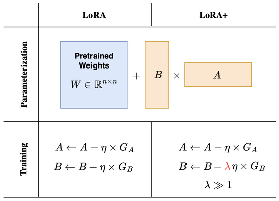

# Pendahuluan
Dalam praktisnya model auto-regressive (seperti Llama dan GPT) telah membuktikan keunggulannya dalam generasi teks, memberikan jawaban yang koheren, kontekstual, dan hampir menyerupai manusia, tetapi di sisi lain model difusi —yang awalnya didesain untuk generasi gambar— mulai memberikan potensi untuk dikembangkan kedalam ranah LLM (Large Language Model) bahkan memberikan rivalitas terhadap model auto-regressive dalam pemrosesan bahasa.
## Apa itu Model Auto-Regressive (AR)
Dalam model LLM modern, AR menjadi tulang punggung-nya. Dengan menerapkan prinsip dasarnya, yaitu memprediksi token berikutnya berdasarkan semua token sebelumnya yang telah dihasilkan. 
$$
p_\theta(x) = p_\theta(x^1) \prod_{i=2}^L p_\theta(x^i \mid x^1, \ldots, x^{i-1}),
$$
Dimana x adalah panjang sequence dari L, dan $x^i$ adalah token ke i. Paradigm ini telah dibuktikan efektif, tetapi sifat AR dari LLM menimbulkan permasalahan berupa biaya komputasi yang tinggi, dikarenakan pembuatan token secara satu-per-satu. Sehingga, LLM kurang mampu menangani tugas-tugas yang lebih panjang dan lebih kompleks. Seperti tugas yang membutuhkan penalaran mundur (reversal reasoning)
Maka dari itu, LLaDA (Large Language Diffusion with Masking) diciptakan dengan tujuan menutupi kekurangan AR (sekaligus menyainginya).
## Apa itu LLaDA (Large Language Diffusion with Masking)
LLaDA adalah model generatif bahasa berbasis difusi dengan masking (masked diffusion), yang menggantikan pendekatan auto-regressive dengan mengaburkan token secara dinamis selama pelatihan (Random Masking) dan Memulihkan semua token yang di-mask secara bersamaan (parallel). 
Tidak seperti AR, LLaDA mendifinisikan distribusi model $pθ(x0)$ melalui proses forward dan reverse. Dimana:
Proses forward ($forward process$), akan secara bertahap memasking token dalam $x0$ secara independent. Setiap token memiliki probabilitas $t>$ untuk dimasking atau tetap dimasking dalam probabilitas 1-t. 
Proses reverse ($reverses procceses$), adalah proses memulihkan distribusi data secara iterative memprediksi token yang dimasking saat $t>$ bergerak dari 1 ke 0.
Inti dari LLaDA sebenarnya adalah sebuah “mask predictor” $(pθ(·|xt))$ yang memprediksi token yang dimasking saat t bergerak dari 1 ke 0. Model LLaDA dilatih menggunakan loss cross-entropy yang dihitung hanya pada token yang dimasking:
$$
\mathcal{L}(\theta) \triangleq -\mathbb{E}_{t, x_0, x_t} \left[ \frac{1}{t} \sum_{i=1}^{L} \mathbf{1}[x_t^i = \mathbf{M}] \log p_{\theta}(x_0^i \mid x_t) \right]
$$
Di mana $x0$ diambil dari data pelatihan, t diambil secara uniform dari $[0,1]$, dan $x_t$ diambil dari proses forward. Fungsi indikator $1[·]$ memastikan loss hanya dihitung pada token yang dimasking.
Visualisasi pelatihan model LLaDA adalah seperti:
<iframe style="width:100%; height:50vh" src="https://editor.p5js.org/imammuhammaddiponegoro/full/ntrEGYwt6"></iframe>

### Kesimpulan Perbedaan Keduanya?
| Aspek                        | Model Bahasa Tradisional (Auto-regressive)           | LLaDA (Diffusion-based)                               |
|-----------------------------|------------------------------------------------------|--------------------------------------------------------|
| Prinsip Utama               | Memprediksi token berikutnya berdasarkan token sebelumnya | Menggunakan prinsip difusi dengan masking            |
| Pola Generasi               | Sekuensial, satu token per waktu                     | Paralel, seluruh token sekaligus                      |
| Kecepatan Inferensi         | Cenderung lebih lambat karena bersifat sekuensial    | Lebih cepat karena proses paralel                    |
| Contoh Model                | GPT, LLaMA, Claude                                   | LLaDA                                                 |
## Masalah pada Model Bahasa Besar (LLM)
Meskipun LLM autoregresif (seperti LLaMA) dan model berbasis difusi (LLaDA) memiliki kelebihannya masing masing, melatih parameter yang mencapai miliaran akan menimbulkan masalah baru ketika kita ingin melakukan fine-tuning. Pertama, biaya komputasi untuk full fine-tuning bisa eksplosif. Sebagai contoh, melatih ulang LLaMA-2 70B memerlukan cluster GPU high-end dengan biaya ribuan dolar per pelatihan. Kedua, modifikasi seluruh parameter sering menyebabkan Catastrophic Forgetting—fenomena di mana model 'lupa' pengetahuan dasarnya setelah berfokus pada data baru. Misalnya, model yang di-fine-tune* untuk terjemahan bahasa mungkin kehilangan kemampuannya menjawab pertanyaan umum."*
Disinilah, terdapat sebuah solusi bernama Parameter-Efficient Fine-Tuning (PEFT) yang alih alih melatih ulang semua parameter, PEFT hanya menyesuaikan sebagian kecil (≤1%). Beberapa teknik yang akan digunakan dalam penelitian kami adalah “LoRA”, “LoRA+”, dan “PiSSA”

### LoRA (Low-Rank Adaptation) 

LoRA adalah salah satu teknik PEFT, dimana alih-alih memodifikasi keseluruhan parameter dengan mengubah weight matrices di layer tertentu (biasanya attention dan feed-forward) yang memakan sumber daya komputasi dan berisiko catastrophic forgetting. LoRA akan menyisipkan dua matriks kecil dengan rank rendah (low-rank matrices) yang akan dilatih. 
LoRA tidak mengubah bobot ($W$) secara langsung, tetapi menambahkan dua matrix kecil (B dan A):
$$
W_{\text{adapted}} = W + (B \times A)
$$
B dan A akan jauh lebih kecil (misalnya 8×64) disbanding $W$ (4096 × 4096). Hanya B dan A yang akan dilatih, sementara $W$ akan dibekukan ($frozen$). Intinya LoRA digunakan karena biaya komputasi kami yang tidak berlimpah. Dan secara praktik memang lebih hemat.
### LoRA+ (Low Rank Adaptation Plus)
LoRA+ adalah pengembangan lanjutan dari LoRA, dirancang dengan tujuan yang sama dengan LoRA biasa yaitu meningkatkan efisiensi dan performa fine-tuning LLM. Dua inovasi utama pada LoRA+ adalah:
Optimasi Pembelajaran Terpisah ($Disjoint Learning Rates$), dimana matriks B dan matriks A di LoRA+ menggunakan Learning Rate (LR) yang berbeda. Misalnya, LR untuk B > A, alasan dibalik perbedaan LR ini berdasar pada teori dekomposisi matriks yang menunjukkan bahwa B dan A memiliki sensitivity berbeda terhadap gradien. Penjelasan mengenai perbedaan kedua Teknik ini beserta penggunaan learning rate yang berbeda akan dijelaskan dibawah:

#### LoRA vs LoRA+

terdapat dua versi persamaan pembaruan (update rules) untuk matriks A dan B dalam LoRA. 
1.	Versi Standar (LoRA)
$$
\begin{aligned}
A &\leftarrow A - \eta \times G_A \\
B &\leftarrow B - \eta \times G_B
\end{aligned}
$$
Learning rate (η) sama untuk matriks A dan B. Meskipun lebih mudah diimplementasikan. Terdapat potensi konvergensi yang lebih lambat karena tidak mempertimbangkan peran berbeda dari A dan B.
2.	Versi Kedua (LoRA+)
$$
\begin{aligned}
A &\leftarrow A - \eta \times G_A \\
B &\leftarrow B - \lambda \eta \times G_B \quad (\lambda \geq 1)
\end{aligned}
$$
Learning rate berbeda: Matriks B diperbarui dengan learning rate lebih besar (λη, di mana λ ≥ 1), sementara A tetap menggunakan η. Meskipun Membutuhkan tuning tambahan untuk λ (faktor skala LR seperti Rentang LR: 1e-5 hingga 1e-3 (nilai kecil untuk stabilitas) dan Rentang LR: 1e-4 hingga 1e-2 (lebih besar dari A).

| Aspek                  | LoRA Standar        | LoRA+ / Variasi Lanjutan         |
|------------------------|---------------------|----------------------------------|
| Learning Rate (A)      | η                   | η                                |
| Learning Rate (B)      | η                   | λη (λ ≥ 1)                       |
| Konsep                 | Simetris            | Asimetris (optimalisasi terpisah) |
| Kinerja                | Baik untuk tugas umum | Lebih cepat dan stabil          |

### PiSSA
PISSA (Precise Incremental Spectral Adaptation) adalah teknik adaptasi parameter-efisien terbaru untuk fine-tuning model bahasa besar (LLM)

# Data Preparation 
Data preparation merupakan salah satu langkah terpenting  dalam pengembangan model machine learning atau deep learning.
Pemilihan data yang tepat akan menentukan kualitas model yang dihasilkan dan harus sesuai dengan konteks serta tujuan yang
ingin dicapai. Selain itu, data yang berkualitas akan mempengaruhi kecepatan konvergensi model dan efisiensi komputasi
selama proses pelatihan.

Untuk Projek transfer learning model LLaDA ke Bahasa Indonesia
dataset yang kami gunakan adalah *Cendol Collection V2* yang merupakan dataset 
yang dikembangkan oleh IndoNLP untuk melatih model mereka bernama cendol. 
Dataset merupakan dataset open source berbahasa Indonesia, Bahasa melayu, dan juga banyak Bahasa daerah di Indonesia. 
Dataset cendol sendiri berjumlah sekitar 12,8 juta baris data.

## Data Training

### pengambilan subset bahasa Indonesia
Untuk mempercepat konvergensi dan efisiensi komputasi, pada projek ini 
kami hanya mengambil subset data berbahasa Indonesia saja, kemudian dilakukan clustering. 
Dengan hasil rasio akhir 0.08% dari dataset asli.

- Dari dataset Cendol Collection v2 , diambil subset berbahasa Indonesia dari column subset_name, yaitu: 
    - indo_puisi 
    - wikihow 
    - wikipedia_id 
    - safety_prompt
    - identity_prompt
    - dolly. 
    Subset ini mewakili sekitar 50% dari populasi awal, dengan total sebanyak 6.542.630 .

### Stratified Random Sampling
Dilakukan stratified random sampling pada subset-subset berbahasa Indonesia tersebut
terhadap column template_names, menghasilkan 196.279 instansi, yaitu sekitar 0,3% dari total sampel awal.

### Clustering untuk Reduksi Data
Untuk meminimalkan jumlah sampel sekaligus menjaga keragaman data, dilakukan proses clustering menggunakan 
K-Means dengan K = 10. Pemilihan nilai K mempertimbangkan efisiensi komputasi dan distribusi yang merata pada hasil akhir.

#### Embedding Menggunakan IndoBERT
- Sebelum proses clustering, seluruh instansi diubah menjadi representasi dense embedding menggunakan model IndoBERT-p1-cased.
IndoBERT dipilih sebagai model untuk menghasilkan embedding karena dilatih khusus untuk Bahasa Indonesia, 
sehingga mampu menangkap grammar, kosakata, dan makna kontekstual yang unik untuk Bahasa Indonesia lebih 
baik dibandingkan model multilingual seperti mBERT. Hal ini meningkatkan kualitas clustering karena dapat 
menangkapm semantik yang lebih baik.

#### K-Means Clustering
Untuk meminimalkan jumlah sampel sekaligus menjaga keragaman data, 
dilakukan proses clustering menggunakan K-Means dengan parameter:
- K = 10 cluster
- Random state: 42
- Metrik distace: Euclidean 

plot dengan umap untuk memvisualisasikan hasil clustering:

#### Strategi Sampling dari Cluster
Dari setiap cluster, diambil 1.000 instansi. Jika jumlah instansi dalam suatu cluster kurang dari 1.000, 
dilakukan augmentasi dengan instansi dari cluster lain hingga mencapai total 10.000 instansi.

### Data Testing
Dataset testing diambil menggunakan stratified random sampling dari subset-subset berbahasa Indonesia yang mana proses tersebut sama seperti yang 
dilakukan pada  data training.
Untuk memastikan tidak ada kebocoran data (data leakage), data testing dipastikan tidak memiliki irisan dengan data training yang
telah dihasilkan dari proses clustering sebelumnya.

Untuk langkah-langkah pengambilan data testing sebagai berikut:

1. Menggunakan subset data berbahasa Indonesia yang sama seperti data training:
    - indo_puisi
    - wikihow 
    - wikipedia_id
    - safety_prompt
    - identity_prompt
    - dolly
2. Melakukan stratified random sampling berdasarkan column template_names untuk menjaga proporsi kategori
3. Memfilter data untuk memastikan tidak ada overlap dengan data training yang telah digunakan
4. Mengambil sebesar 0.02% data dengan stratified random undersampling, menghasilkan 394 data
5. Melakukan random sampling final sebesar 100 data untuk mendapatkan final test set 

### Data preprocessing
Tahap preprocessing mencakup proses tokenisasi dan formatting data untuk disesuaikan dengan format
instruction-tuning yang digunakan base model. Hal ini penting agar model dapat merespon adapter LoRA
dengan tepat. 

#### Tokenisasi
- Proses tokenisasi menggunakan tokenizer bawaan dari base model yaitu LLaDA
- Trunction maksimum 512 untuk processing embedding

#### Format instruction tuning
- instruction-tuning mengadopsi format Llama 3.1  
- Untuk mengoptimalkanproses, sequence length dibatasi maksimum 512 token, dimana prompt yang melebihi batas akan mengalami trunkasi. 

Telah selesai langkah-langkah data preparation.