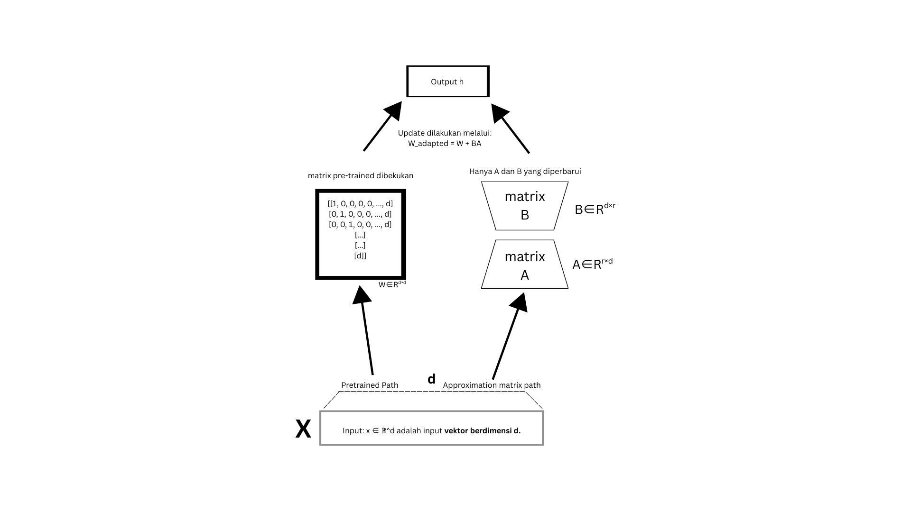

# Pendahuluan
Dalam praktisnya model auto-regressive (seperti Llama dan GPT) telah membuktikan keunggulannya dalam generasi teks, memberikan jawaban yang koheren, kontekstual, dan hampir menyerupai manusia, tetapi di sisi lain model difusi —yang awalnya didesain untuk generasi gambar— mulai memberikan potensi untuk dikembangkan kedalam ranah LLM (Large Language Model) bahkan memberikan rivalitas terhadap model auto-regressive dalam pemrosesan bahasa.
## Apa itu Model Auto-Regressive (AR)
Dalam model LLM modern, AR menjadi tulang punggung-nya. Dengan menerapkan prinsip dasarnya, yaitu memprediksi token berikutnya berdasarkan semua token sebelumnya yang telah dihasilkan. 
$$
p_\theta(x) = p_\theta(x^1) \prod_{i=2}^L p_\theta(x^i \mid x^1, \ldots, x^{i-1}),
$$
Dimana x adalah panjang sequence dari L, dan $x^i$ adalah token ke i. Paradigm ini telah dibuktikan efektif, tetapi sifat AR dari LLM menimbulkan permasalahan berupa biaya komputasi yang tinggi, dikarenakan pembuatan token secara satu-per-satu. Sehingga, LLM kurang mampu menangani tugas-tugas yang lebih panjang dan lebih kompleks. Seperti tugas yang membutuhkan penalaran mundur (reversal reasoning)
Maka dari itu, LLaDA (Large Language Diffusion with Masking) diciptakan dengan tujuan menutupi kekurangan AR (sekaligus menyainginya).
## Apa itu LLaDA (Large Language Diffusion with Masking)
LLaDA adalah model generatif bahasa berbasis difusi dengan masking (masked diffusion), yang menggantikan pendekatan auto-regressive dengan mengaburkan token secara dinamis selama pelatihan (Random Masking) dan Memulihkan semua token yang di-mask secara bersamaan (parallel). 
Tidak seperti AR, LLaDA mendifinisikan distribusi model $pθ(x0)$ melalui proses forward dan reverse. Dimana:
Proses forward ($forward process$), akan secara bertahap memasking token dalam $x0$ secara independent. Setiap token memiliki probabilitas $t>$ untuk dimasking atau tetap dimasking dalam probabilitas 1-t. 
Proses reverse ($reverses procceses$), adalah proses memulihkan distribusi data secara iterative memprediksi token yang dimasking saat $t>$ bergerak dari 1 ke 0.
Inti dari LLaDA sebenarnya adalah sebuah “mask predictor” $(pθ(·|xt))$ yang memprediksi token yang dimasking saat t bergerak dari 1 ke 0. Model LLaDA dilatih menggunakan loss cross-entropy yang dihitung hanya pada token yang dimasking:
$$
\mathcal{L}(\theta) \triangleq -\mathbb{E}_{t, x_0, x_t} \left[ \frac{1}{t} \sum_{i=1}^{L} \mathbf{1}[x_t^i = \mathbf{M}] \log p_{\theta}(x_0^i \mid x_t) \right]
$$
Di mana $x0$ diambil dari data pelatihan, t diambil secara uniform dari $[0,1]$, dan $x_t$ diambil dari proses forward. Fungsi indikator $1[·]$ memastikan loss hanya dihitung pada token yang dimasking.
Visualisasi pelatihan model LLaDA adalah seperti:
<iframe style="width:100%; height:50vh" src="https://editor.p5js.org/imammuhammaddiponegoro/full/ntrEGYwt6"></iframe>

## Kesimpulan Perbedaan Keduanya?
| Aspek                        | Model Bahasa Tradisional (Auto-regressive)           | LLaDA (Diffusion-based)                               |
|-----------------------------|------------------------------------------------------|--------------------------------------------------------|
| Prinsip Utama               | Memprediksi token berikutnya berdasarkan token sebelumnya | Menggunakan prinsip difusi dengan masking            |
| Pola Generasi               | Sekuensial, satu token per waktu                     | Paralel, seluruh token sekaligus                      |
| Kecepatan Inferensi         | Cenderung lebih lambat karena bersifat sekuensial    | Lebih cepat karena proses paralel                    |
| Contoh Model                | GPT, LLaMA, Claude                                   | LLaDA                                                 |
## Masalah pada Model Bahasa Besar (LLM)
Meskipun LLM autoregresif (seperti LLaMA) dan model berbasis difusi (LLaDA) memiliki kelebihannya masing masing, melatih parameter yang mencapai miliaran akan menimbulkan masalah baru ketika kita ingin melakukan fine-tuning. Pertama, biaya komputasi untuk full fine-tuning bisa eksplosif. Sebagai contoh, melatih ulang LLaMA-2 70B memerlukan cluster GPU high-end dengan biaya ribuan dolar per pelatihan. Kedua, modifikasi seluruh parameter sering menyebabkan Catastrophic Forgetting—fenomena di mana model 'lupa' pengetahuan dasarnya setelah berfokus pada data baru. Misalnya, model yang di-fine-tune* untuk terjemahan bahasa mungkin kehilangan kemampuannya menjawab pertanyaan umum."*
Disinilah, terdapat sebuah solusi bernama Parameter-Efficient Fine-Tuning (PEFT) yang alih alih melatih ulang semua parameter, PEFT hanya menyesuaikan sebagian kecil (≤1%). Teknik yang digunakan dalam penelitian kami adalah “LoRA”, "LoRA+"".

## LoRA (Low-Rank Adaptation) sebagai Solusi
LoRA adalah salah satu teknik PEFT, dimana alih-alih memodifikasi keseluruhan parameter dengan mengubah weight matrices di layer tertentu (biasanya attention dan feed-forward) yang memakan sumber daya komputasi dan berisiko catastrophic forgetting. LoRA akan menyisipkan dua matriks kecil dengan rank rendah (low-rank matrices) yang akan dilatih. 

