----

tl;dr long post bub, gw lagi halulu:

> me wana du RE wit LLM, y?   
> cuz eksploit w/ llm suks, so dongred a bit.  
> bytecode trenslashun shuda been ez on peper,  
> butt inpractice not sedge.  
> wil explor moar so  
> luk forward to da [series](../../tags/rellm) kek

----

# preface

> Thought: Why has most AI usage in cybersec that catch on are use-cases where they're pretty much passive actors? I.e., think whitebox scanners, IDS, etc.  
> 
> Why has there not been a lot of research on something that operates on *live* systems, red-teaming (?), like, I dunno, automated web app pentesting? Automated adaptive spearphishing/soceng? WHy NoT AUToMaTED LlM ByTECoDE DEcoMPILation???? :thonk:

Ba-da-bing ba-da-boom, we here nao.

Okay, to be fair, I *was* being a bit dismissive in that initial statement. There *has*, obviously, been research on this front lol [@NEURIPS2024_69d97a64; @fang2024llmagentsautonomouslyexploit]. 

~~this is such a low-hanging fruit that idt that we can ever be called homo "sapiens" ever again if no one's tried them yet :skull:~~

However, what I was mostly interested in is the *"why"* behind us not having yet succeeded in getting this thing off the ground. 

This thought has on-and-off passed my mind since about a year ago,

of applying LLMs to cybersec ~~which, coincidentally, is about when I started to do CTF w/ HCS too lol, def no correlation there *cough*~~.

# intuition

Intuitively, this makes pretty straightforward sense. Just, have an LLM interface with some tooling, have it run against a white-/grey-/black-box app, and ***boom***, ask it to just, propose payloads, run them in the tooling, verify, rinse and repeat, basically.

Like, I had something like this in mind back then, just thinking about it for some few minutes:
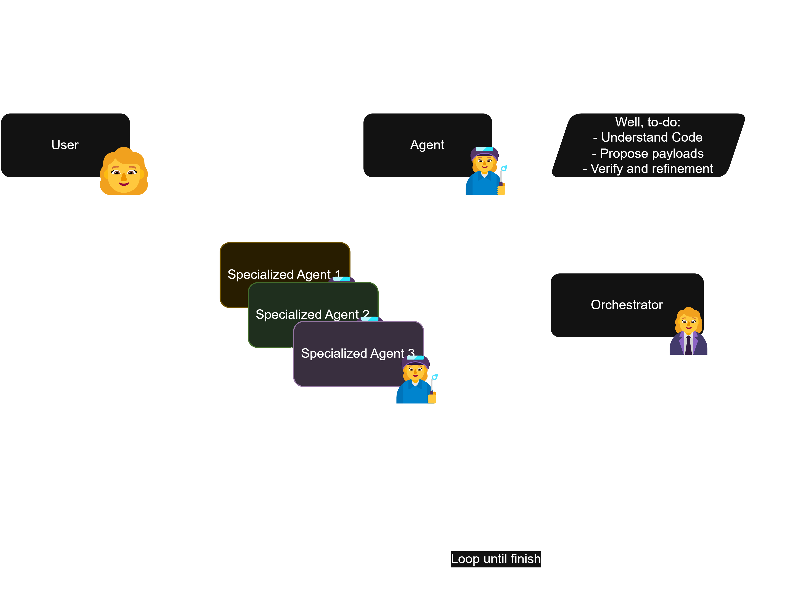
In fact, I've tried to do this before with Microsoft's [autogen](https://github.com/microsoft/autogen) then, and it worked... somewhat okay-ly, took some 3 hours for it to get a basic SSTI chall lmfao :moyai: is why I never published it. 
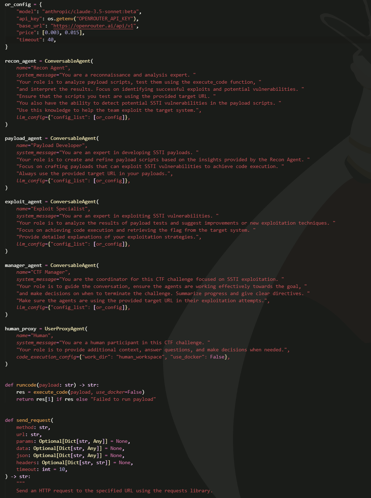

...mmm, okay, to be fair, what I'd used before weren't exactly known-to-be-good-at-CTF models, it was like, Nous' Hermes [405B](https://huggingface.co/NousResearch/Hermes-3-Llama-3.1-405B), Llama 3.1 70B, and Claude 3.5 Sonnet, back when it was still in beta. 

I only used those because they were free iirc, lolol. With the advent of R1 and all these reasoning models, I might have to give it another look soon, so look forward to that post lmoa.

Anywae, wher problem then? Well, problem shows up when you have to consider the sheer search space that the LLM has to explore for any app, even if a task is white-boxed. 

Speaking from experience doing CTFs, even on white-boxed challs, when we have to do active exploitation w/ an LLMs, I've always had that fair share of talking to Claude, where I've had to clarify the setup, or like, literally actively guide it to *something* that'd remotely even make sense as a lead. 

So, for a while I've always kinda seen it as like, the human as the orchestrator agent, and the LLM as the payload agent. Which works, btw. I've done most CTFs w/ an LLM by my side, so 🤷‍♀️ But still, again, problem, LLM no find solution n get halulu too dang quick, not applicable to do the whole "replace the weakness of my flesh for machine-powered hackerman :3" thing.

# finally, content

***SO,*** why not pivot over to smth a bit more on the "semi-active" side of exploitation? What about... <u>Reverse Engineering</u>?

Ta-dah, we're finally here. So let's talk about the stuff we'll try to go over for this series. And yes, I'm making this a [series](../../tags/rellm), since I think that there's a good amount of ground to cover here.

For starters, let's go over the handwaving.

## handwaving

The intuition here is that, any kind of instruction code, whether it be bytecode, or straight up opcodes, is, *technically*, a structured language.

Let's take an example, let's work w/ smth that's a bit simple, take python's `.pyc` bytecode, given
```python
def add(a, b):
    return a + b
```
this compiles down into a bytecode that looks like:  
```pyc
0: RESUME 0
2: LOAD_FAST a
4: LOAD_FAST b
6: BINARY_OP 0
10: RETURN_VALUE None
```

See that the thing can, at the moment, for the most part, easily deciphered by us. Like, at this point you might as well kinda call it almost like an RPN of the function lol, so something like this, can easily be deciphered algorithmically.

But let's take... I dunno, something like:
```python
def yummy(param1, param2):
  return (param1**2 + param2**2)**0.5
```

this shit alrd compiles down to smth that looks a bit more, "hmmm..."
```pyc
0: RESUME 0
2: LOAD_FAST param1
4: LOAD_CONST 2
6: BINARY_OP 8
10: LOAD_FAST param2
12: LOAD_CONST 2
14: BINARY_OP 8
18: BINARY_OP 0
22: LOAD_CONST 0.5
24: BINARY_OP 8
28: RETURN_VALUE None
```
Like, if you know the opcodes and how this reads, I think you can for the most part parse this still, but I think you should start to see my point on why this won't scale easily. 

This gets very janky when your task in RE challenges is almost always working w/ compiled code. If you're not used to reading bytecode, or don't have access to a decent decompiler for your language, you're basically screwed to rev a program, unless it can be fuzzed out or something.

The good thing however, is that, well, since your computer also needs to read this thing and decipher it to actually *execute* it, the way that this "translation" goes, compilation, is "deterministic". In the sense that, the way that it's transformed, will always be the same, ...assuming that the *context*, that is, your device/platform, is the same. 

Ofc, if you have access to the platform of the program's compiler that's not... really doing rev lol, like, you can basically just `Input XOR Compilation XOR Compilation` it at this point, you know the operations :skull: so in practice, we assume that we only have the compiled thing.

Now, looking at this from a language modelling perspective, specifically translations, this is interesting. Because the thing about doing translation tasks is that, in my experience, most of the issues with regard to syntactical (grammatical) validity, has for the most part, become a "solved" problem with the rise of attention mechanisms. The way that they model relationships is about in line with how language is already practically done, with most relationships requiring global, rather than local, modelling. 

(Although this isn't necessarily the case all the time, I've done a bit of an experiment recently on this for [KCV](https://github.com/kcv-if)'s lab admin open recruitment assignment, might go over that in some other post)

## translation hard 4 resource-constrained languages

So, the problem? Data. Good data, specifically. I recently did some research on finetuning a Llama 3.2 1B model for a Machine Learning class final project (which we submitted for publishing btw (!!!) so look out for an edit here if it gets accepted lmao) to do transfer learning on Indonesian.

The reason why Indonesian was used here, was that Indonesian, specifically day-to-day, non-formal Indonesian, is often underrepresented, especially in smaller models. So our focus was to train this model to know more about speaking Indonesian, and because we couldn't really burn *that* much money as to do a full parameter tune, we ran it by a LoRA+ optimizer.

The results?
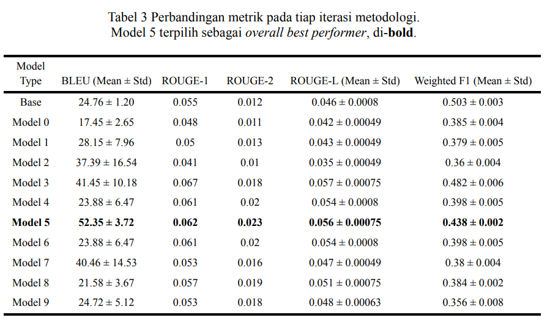
It worked! For the most part. Although, as you can see, there's definitely a lot to be desired here, the forgetting incurred by the tune (see that f1 decline, we used cosine similarity to measure the semantic "correctness" against the ref text) really impacted the resulting model in practical use.

The major factors we identified in this, was that, again, good data and sampling. Having more data does not necessarily say that you'll get better results. 

The reason why our thing got really good results, was that the dataset that we had used, Cendol Collection [@cahyawijaya-etal-2024-cendol], was good. Cahyawijaya et al.'s work has always been amazing on this front, and they specifically have always brought up how Indonesian languages have always kinda been a very low-resource language when it comes to well-gathered data. 

(Although I do want to say that this has been progressively changing for a while now with IndoNLP and all)

## not... resource-constrained?

You read that right. As I've explained above, compilation is a deterministic and replicable process. For the most part, ambiguity and unreliability in gathering data points, is "gone". In the sense that, well, once compiled, a program will run the same way all the time on the same platform. Unlike language, which can be interpreted in different ways even by the same person, or even the author themselves at a later period of time.

Meaning? Well, synthetic data. Good, synthetic, data. 

Unlike traditional translation tasks, to synthesize "good" bytecode, it's literally just, running some generated code into the compiler, and ***boom***, you have a native "speaker" for that "platform" that can process however many you need to synthesize, and they'll all be "top-of-the-line" translations for that language all the time, no tired, no mood, no unreliability in translations.

As such, to train a model to do a bytecode translation task, we've finally also knocked down the other thing. Now, ofc, there's the concern w/ augmentations and robustness, like, obfuscation, or complex long, winded, execution chains, but regardless, that problem with finding new data points to train on, has for the most part, been solved here.

# work

So, let's get to it, then.

There's a lot of ground to cover, so for this first initialization part, we'll just go over pretty rough drafts, working with a simpler bytecode, python's `.pyc`.

Let's whip up smth that "works" first, and iterate on that in the next posts.

## dataset curation. 

Now, I'm sure that there's probably some dataset out there of malware sample bytecodes that we can try running by this, but at the moment, just to prove the concept, let's put that to the side for now.

To do dataset curation, let's try whipping up a synthesizing pipeline, as— again— as I've gone over above, the reduction in fidelity in synthesized data should, overall, be pretty insignificant.

Going back and forth with claude, got myself this going for now
```python
import dis
from typing import Tuple, List

def get_function_bytecode(source: str) -> List[dis.Instruction]:
    # Compile to code object
    code = compile(source, "<string>", "exec")
    # Get the function's code object (it's in the constants)
    func_code = code.co_consts[0]
    # Get bytecode instructions
    return list(dis.get_instructions(func_code))

def generate_complex_expr(available_vars):
    # Generate more complex expressions with multiple operations
    num_ops = random.randint(1, 3)
    expr = random.choice(available_vars + [str(random.randint(1, 100))])

    for _ in range(num_ops):
        op = random.choice(["+", "-", "*", "/"])
        next_term = random.choice(available_vars + [str(random.randint(1, 100))])
        expr = f"({expr} {op} {next_term})"

    return expr

def generate_clean_function() -> str:
    num_params = random.randint(1, 6)  # More params possible
    param_names = [f"param_{i}" for i in range(num_params)]
    unused_params = set(param_names)

    body_lines = []
    available_vars = param_names.copy()

    # First temp uses complex expression with unused param
    var_name = f"temp_{random.randint(1,100)}"
    param = random.choice(list(unused_params))
    unused_params.remove(param)
    expr = generate_complex_expr([param])  # Use only this param initially
    body_lines.append(f"{var_name} = {expr}")
    current = var_name
    available_vars.append(current)

    # Generate 2-8 intermediate computations
    num_computations = random.randint(2, 8)
    for _ in range(num_computations):
        var_name = f"temp_{random.randint(1,100)}"

        # Try to use unused param if available
        if unused_params and random.random() < 0.7:  # 70% chance to use new param
            param = random.choice(list(unused_params))
            unused_params.remove(param)
        else:
            param = random.choice(available_vars)

        expr = generate_complex_expr(
            [current, param] + available_vars[-2:]
        )  # Use recent vars
        body_lines.append(f"{var_name} = {expr}")
        current = var_name
        available_vars.append(current)

    # Complex return expression using multiple vars
    return_expr = generate_complex_expr(
        [current] + random.sample(available_vars, min(3, len(available_vars)))
    )
    body_lines.append(f"return {return_expr}")

    body = "\n    ".join(body_lines)
    return f"def func_{random.randint(1,1000)}({', '.join(param_names)}):\n    {body}"
```
This already adds some level of augmentations by having, sometimes, unused vars, and, I also have
```python
def augment_with_deadcode(func_str: str) -> str:
    # Split into lines
    lines = func_str.split("\n")
    header = lines[0]  # function definition
    body = lines[1:]  # body including return

    # Add 1-3 dead computations
    num_dead = random.randint(1, 3)
    for _ in range(num_dead):
        # Generate a dead computation
        var_name = f"temp_{random.randint(1,100)}"
        # Can use any existing var or number
        expr = f"({random.randint(1,100)} {random.choice(['+', '-', '*', '/'])} {random.randint(1,100)})"
        dead_line = f"    {var_name} = {expr}"

        # Insert at random position before return
        pos = random.randint(1, len(body) - 1)  # -1 to avoid inserting after return
        body.insert(pos, dead_line)

    return header + "\n" + "\n".join(body)
```
to do more augmentation with deadcode injection.

Wrapping up, the dataset is then generated like
```python
def prepare_dataset(n_samples=1000):
    dataset = []
    for _ in range(n_samples):
        func = generate_clean_function()
        bytecode, source = prepare_training_sample(func)

        # Add clean version
        dataset.append({"input": bytecode, "target": source})

        # Maybe add augmented version
        if random.random() < 0.5:
            aug_func = augment_with_deadcode(func)
            aug_bytecode, _ = prepare_training_sample(aug_func)
            dataset.append({"input": aug_bytecode, "target": source})

    return dataset
```

So that we can input the bytecode into the model to be processed, we'll have to format it first. Here, I took a pretty simple approach, just, concat everything into one line delimited by  ` | `.
```python
def format_bytecode(instructions: List[dis.Instruction]) -> str:
    formatted = []
    for inst in instructions:
        if inst.argval is None:
            formatted.append(f"{inst.opname}")
        else:
            formatted.append(f"{inst.opname} {inst.argval}")
    return " | ".join(formatted)


def prepare_training_sample(func_str: str) -> Tuple[str, str]:
    code = compile(func_str, "<string>", "exec")
    func_code = code.co_consts[0]
    instructions = list(dis.get_instructions(func_code))
    bytecode_str = format_bytecode(instructions)
    return bytecode_str, func_str
```

Setting up the `Dataset` class for the dataloader later,
```python
class BytecodeDataset(Dataset):
    def __init__(self, data, tokenizer, max_length):
        self.data = data
        self.tokenizer = tokenizer
        self.max_length = max_length

    def __len__(self):
        return len(self.data)

    def __getitem__(self, idx):
        item = self.data[idx]

        inputs = self.tokenizer(
            item["input"],
            padding="max_length",
            truncation=True,
            max_length=self.max_length,
            return_tensors="pt",
        )

        targets = self.tokenizer(
            item["target"],
            padding="max_length",
            truncation=True,
            max_length=self.max_length,
            return_tensors="pt",
        )

        return {
            "input_ids": inputs["input_ids"].squeeze(),
            "attention_mask": inputs["attention_mask"].squeeze(),
            "labels": targets["input_ids"].squeeze(),
        }
```

# modelling~

Thus begins the part which I like more, doing actual fkin modelling. For translation tasks, the rationale here is pretty simple, your output has to relate to the input as the decoder outputs a sequence.

## approaches?

Here, we can do it a few different ways, some off the top of my head are:   

***a.) The usual, classical, "Attention is All You Need" approach:*** That is, using a seq2seq encoder-decoder structure, this is what's tried and tested for this, some more modern one is something like a T5. Let's do a quick brief.

The idea here is that, the encoder runs the input into latent space, *then* via cross attn, shove that into the attn of the decoder. 

See that cross attn? This thing
When we do it this way, the decoder, while still doing things autoregressively, can attend to the entire input sequece as per the encoder's latent. 

This is good, because, well, intuitively, you want the next outputs of a translation model to both take in the intial translated sequence *and* the already-generated output sequence. 

Problem? ***This scales up waaay too quickly.*** If you've heard of that $O(n^2)$ figure of asymptotic complexity in transformer models, this is where it comes from, this is the worst-case case. 

The encoder, doing full-scale self-attention computation, has to compute, for every token, its attention score with respect to every other token, and this makes it an $O(n^2)$ asymptotic complexity operation. 

<figure>
<iframe src="https://editor.p5js.org/spuuntries/full/UAhHiNxY8" style="width: 100%; height: 450px"></iframe>
<figcaption>Here's a visual I did with a bit of p5.js and claude, hover on the encoder tokens to see the full self-attn, on the decoder tokens to see the cross attn + masked self-attn</figcaption>
</figure>

If you look at the structures of both components up there, you're gonna notice that they both have similar structures, just that decoder has a masked attn, and this means that, when doing decoding, we do that self-attention thing on the outputted sequence thus far (the rest is masked away), *and* on the entire input sequence.

This is... well, basically $2 \times n^2$ at worst complexity lol (ofc not gonna be n practically, but ygwim, the asymptotic worst-case upper-bound here converges at $n^2 \times 2$ since there are two components at $O(n^2)$, in fact, you can prolly argue that the crossattn, since it's just, self-attn too technically, it's $3 \times n^2$ lol)  

***b.) An autoregressive, decoder-only model:*** Take some decoder-only model, like Llama, shove that into a tuning regimen, boom.

The intuition here is that— okay, wait, decoder-only models, if you're not familiar with them ~~which, I mean, you must've been living under a rock tbh what~~, let's do a quick brief.

It's basically the same as the encoder-decoder we went thru above, just that this is purely relying on the decoder, that self-attention, the uh, masked thing, to do the attention computation.
What means? Well, essentially, treat the input sequence as prior outputs, predict <u>autoregressively.</u>

<figure>
<iframe src="https://editor.p5js.org/spuuntries/full/1uDMq_cwh" style="width: 100%; height: 300px"></iframe>
<figcaption>Here's a visual I did with a bit of p5.js and claude, hover on the tokens to see the masked self-attn, observe that there's no more of that cross-attn operation</figcaption>
</figure>

This means that the resulting computations are, *technically*, a slight bit lighter, since, instead of doing the entire $O(n^2)$ is now only done on the "outputted" sequence only, which will slowly grow in size as the input gets processed autoregressively instead of the entire ctx window getting digested *and* some more (i.e., there's always gonna be this space allocated for the encoder's latent first in the prev one, right).

Issue with this? Well, so far, I don't really see much. One problem with it is the assumption that there's this backward dependency pattern in the structuring of the language, which *can* be an issue when we're doing causal language modelling, but since we're doing translation, it ***can*** be assumed that all the necessary context will always already be in the context window already digested.

**c.) Frankenstein:** This is where we get a bit, mmm, handwavy, but I am hoping to try this out because– well— mmm, hear me out lol.

Let's see, when we're talking abt why the decoder-only approach sucks is that, it inherently assumes that the translated output cannot ever depend "forwardly", since, well, as far as the model's concerned, it's only continuing to shit out what it's alrd shat out, that is, our input.
```md
# Input
Encoder positions:  [0, 1, 2]
Input tokens:      ["I", "love", "femboys"]

# Output
Decoder positions: [0, 1, 2, 3]
Output tokens:     ["J'", "aime", "les", "femboys"]

# Both are still processed regardless tho for each of the output tokens
```

Contrast that with

```md
# Input AND Output, lol.
Positions:    [0,  1,    2,    3,    4,    5,     6,     7]
Tokens:      ["I", "love", "femboys", "->", "J'", "aime", "les", "femboys"]

# That entire sequence is the only thing that gets processed here
```

***BUT,*** here's the thing, when the model's trained this way, there's an interesting big advantage. Remember the shit complexity of the encoder-decoder structure? Because of that, these models often impose some length limit on the input sequence that can be processed by the model.

**This is different in decoder-only models**, where, since the self-attn isn't as bad on encoder-decoders, there's been a lot of exploration on really scaling them up, you might have heard of some extending these models' ctx windows into the **millions of tokens** (!!!) range.

If you've ever played around with these models tho, you'd know that there's a big issue with them, as your window gets bigger, the attention gets diluted. This is why we have that [needle in a haystack](https://github.com/gkamradt/LLMTest_NeedleInAHaystack) (and all its derivatives) problem,  

it shows that there's an inherent limitation when we assume that the entire window can be shoved into latent, the model begins to forget.

Of course, there's been lots of improvements on this, Claude 3.5 Sonnet's already looks like this on their model card (self-reported by Anthropic, but imho they're pretty trustworthy)  
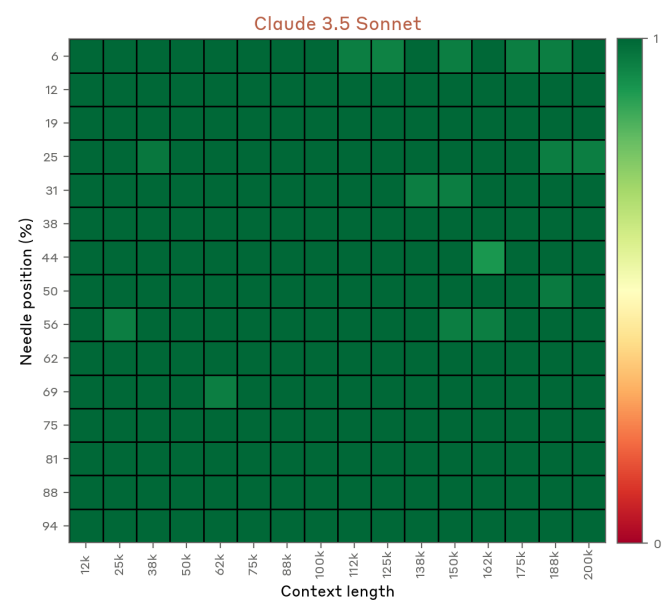
it is though, worth noting that, as far as I'm aware, this scales with parameter count. The larger your model, the better it'll be at preventing this window dilution.

This is why the crossing of contexts in the initial encoder-decoder structure is important, it allows for the full latent scope to not get diluted by the causal nature of the autoregressive predictions. 

In the sense that— hmm, let's see, this gets a bit handwavy, but we can try playing some connect-the-dots here. 

I'll take two perspectives here, the computer vision boi and the LLM engineer boi approach:  

**1.) CV boi owo:** When we talk about it like this, we can see cross-attn as something akin to adding skip connections or residual connections into your conv layers. Think ResNets or DenseNets, or literally any model you've ever coded with a skip connection lol.

We add these connections to allow for gradient to flow from one context to the next, in CV this is because the whole idea with convs is that they're essentially learned image processing kernels, so at each levels of the convnet it'll be processing possibly a completely different looking input, since at each level there will be increasing amts of processing having been applied.

In order to preserve that contextuality of feature space at all layers, we can add these connections to allow for some amounts of it to continue seeping into the next layers.

**2.) LLM Engineer uwu:** If you've ever done a retrieval mechanism for LLMs, it's basically that. You don't want your LLM to hallucinate, so you fetch the context and inject it into the LLM's most-attended-to positions so it can reference it more directly. So you can think of this mechanism as a sort of RAG, but directly on latent operations.

And so, take an encoder off an, either encoder-only, or bidirectional encoder model, so, BERT and friends, shove into a decoder-only's decoder!


***WHY***, would you ever do this? Well, my pov is that encoder-focused models tend to produce very rich representations. This is why we see them used in embedding tasks, their latent spaces are much richer compared to decoders. Decoders, on the other hand, excel at being more "explicit" in how they articulate information.

...Look at it like this, since encoder-focused models are essentially tight bottlenecks, they have to work around a lot of the limitations imposed by the pigeonhole principle, as a result, their latents are *very* efficient at compressing information at relatively high fidelity.

While on decoders, since any kind of latent is otherwise gonna contribute into the output anyway, not much focus is put on making the representation as efficient anymore, since the bottleneck isn't... really there, anymore. The output is decoupled from the input, it's outputting prob logits for a sequence of embeddings, i.e., so it's not embeddings for embeddings anymore.

Anyway, practically, I'd imagine we'll have to shove a projection layer into this, since the latents probably won't match up lol. If you've kept up with multimodal LLMs lately, you'd know that this has become a common approach as of late, one of the main architectures which introduced this as *the* approach afaik was LLaVA [@liu2023visualinstructiontuning],
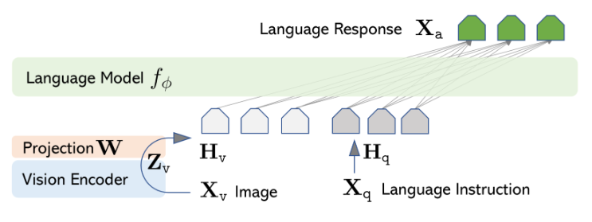
which was to project the embeddings of a visual encoder, CLIP, into the latent of an LLM, Llama.

Intuitively, this should work out fine, but I haven't really tried anything like this out, since, in multimodals, this sorta works out (since otherwise you'll have to train both modalities in parallel, which is *insanely* expensive computationally), but in the same modality, ngl I haven't really seen anyone work on this, at least, not for translation tasks, maybe I need to dig deeper.

# results :bruh:

SOOOOOOOOO for this post, as a starter, let's just run it by something pretty straightforward and intuitive, a LoRA on some encoder-decoder seq2seq. Here, I took three runs to highlight, mostly cuz the other ones were kinda just tweaking and fixing, with `codet5-base` and `codet5-small`.

Here are the plots on the runs, here's the first one, the one on small:

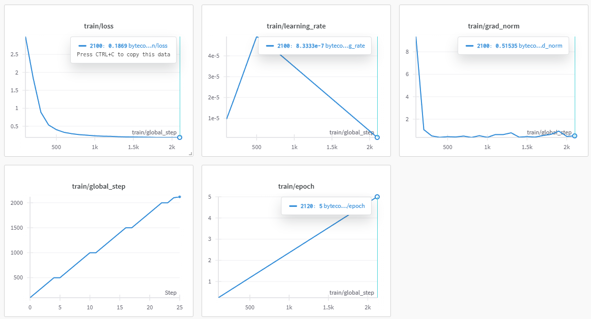
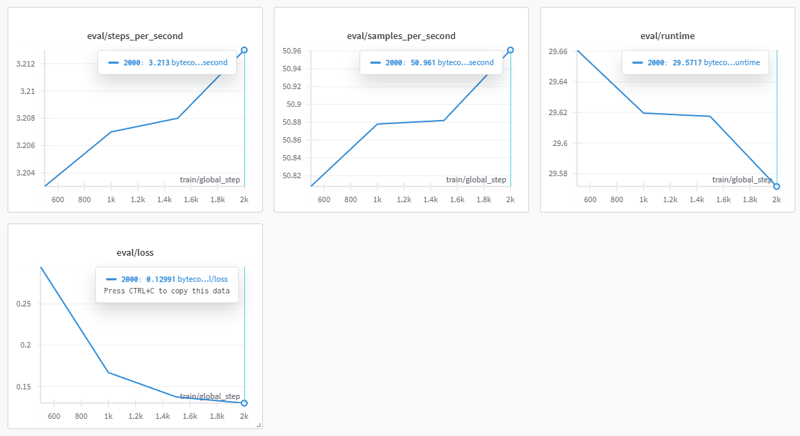

It... "converged", but ran... meh. Here's a sample:

```python
Original function:
def func_167(param_0, param_1, param_2, param_3, param_4, param_5):
    temp_15 = (((param_5 - param_5) + 76) + param_5)
    temp_30 = (((26 / temp_15) * param_0) / param_5)
    temp_20 = (temp_30 + temp_15)
    temp_78 = (((59 + temp_20) * 81) * param_1)
    return ((param_1 + param_0) / param_0)

Bytecode input:
RESUME 0 | LOAD_FAST param_5 | LOAD_FAST param_5 | BINARY_OP 10 | LOAD_CONST 76 | BINARY_OP 0 | LOAD_FAST param_5 | BINARY_OP 0 | STORE_FAST temp_15 | LOAD_CONST 26 | LOAD_FAST temp_15 | BINARY_OP 11 | LOAD_FAST param_0 | BINARY_OP 5 | LOAD_FAST param_5 | BINARY_OP 11 | STORE_FAST temp_30 | LOAD_FAST temp_30 | LOAD_FAST temp_15 | BINARY_OP 0 | STORE_FAST temp_20 | LOAD_CONST 59 | LOAD_FAST temp_20 | BINARY_OP 0 | LOAD_CONST 81 | BINARY_OP 5 | LOAD_FAST param_1 | BINARY_OP 5 | STORE_FAST temp_78 | LOAD_FAST param_1 | LOAD_FAST param_0 | BINARY_OP 0 | LOAD_FAST param_0 | BINARY_OP 11 | RETURN_VALUE

Model output:
def func_529(param_0, param_1, param_2, param_3, param_4, param_5):
    temp_15 = (param_5 * 76)
    temp_30 = (((param_5 - param_5) - 76) - param_5)
    temp_20 = ((temp_30 + temp_15) / param_5)
    temp_78 = (((temp_30 + temp_30) / temp_20) - param_1)
    return (param_0 - param_0)
```

This was on rank 8 with $\alpha$ 8. Wondered if shud scale up, so we upped to a base, got this for run 2:

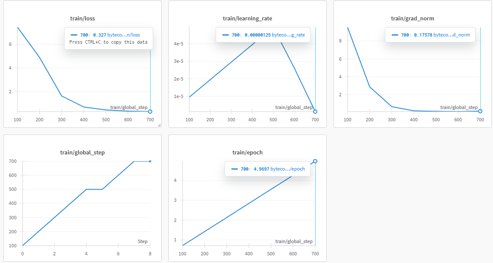
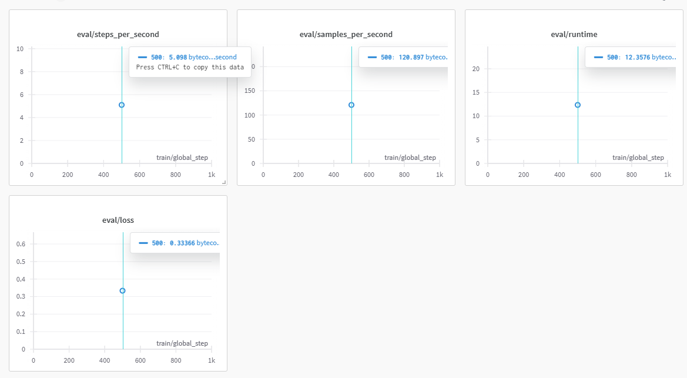

A sample:
```python
Original function:
def func_167(param_0, param_1, param_2, param_3, param_4, param_5):
    temp_15 = (((param_3 - param_3) + 76) + param_3)
    temp_30 = (((26 / temp_15) * param_5) / param_5)
    temp_20 = (temp_30 + temp_15)
    temp_78 = (((59 + temp_20) * 81) * param_1)
    return ((param_1 + param_0) / param_0)

Bytecode input:
RESUME 0 | LOAD_FAST param_3 | LOAD_FAST param_3 | BINARY_OP 10 | LOAD_CONST 76 | BINARY_OP 0 | LOAD_FAST param_3 | BINARY_OP 0 | STORE_FAST temp_15 | LOAD_CONST 26 | LOAD_FAST temp_15 | BINARY_OP 11 | LOAD_FAST param_5 | BINARY_OP 5 | LOAD_FAST param_5 | BINARY_OP 11 | STORE_FAST temp_30 | LOAD_FAST temp_30 | LOAD_FAST temp_15 | BINARY_OP 0 | STORE_FAST temp_20 | LOAD_CONST 59 | LOAD_FAST temp_20 | BINARY_OP 0 | LOAD_CONST 81 | BINARY_OP 5 | LOAD_FAST param_1 | BINARY_OP 5 | STORE_FAST temp_78 | LOAD_FAST param_1 | LOAD_FAST param_0 | BINARY_OP 0 | LOAD_FAST param_0 | BINARY_OP 11 | RETURN_VALUE

Model output:
param_3 | param_3)
    temp_15 = (param_3 * param_3)
    temp_15 = (param_3 * param_3)
    temp_30 = (temp_15 + temp_15)
    temp_20 = (temp_30 + param_5)
    temp_30 = (param_5 + temp_30)
    temp_20 = (temp_30 - temp_30)
    temp_20 = ((temp_30 + temp_15)
    temp_20 = (temp_15 / temp_15)
    return
```

Now, it doesn't take a lot of analysis to see that that... sucks. Here, I did tweak the settings a bit, it was on $\alpha$ 16, which means that the "magnitude" of the movement/step of the adapter is effectively halved when we compare to the previous run. This is also at a dropout of 25%.

The rationale was that since the model's larger, the rank will, intuitively, produce larger vectors, meaning, larger matrices. When we talk about models, the larger, the more likely it is to be suboptimal. 

This could result in both overfitting *and* underfitting (can be interpreted as both undershooting for the optima or getting good convergence but unoptimal weights at all positions, i.e., see Chinchilla's and Gopher's results at scaling [@NEURIPS2022_c1e2faff] [@rae2022scalinglanguagemodelsmethods]), depending on your problem statement setup.

Anyway, upped the $\alpha$ to 32 and rank to 16, with a dropout at 10%.
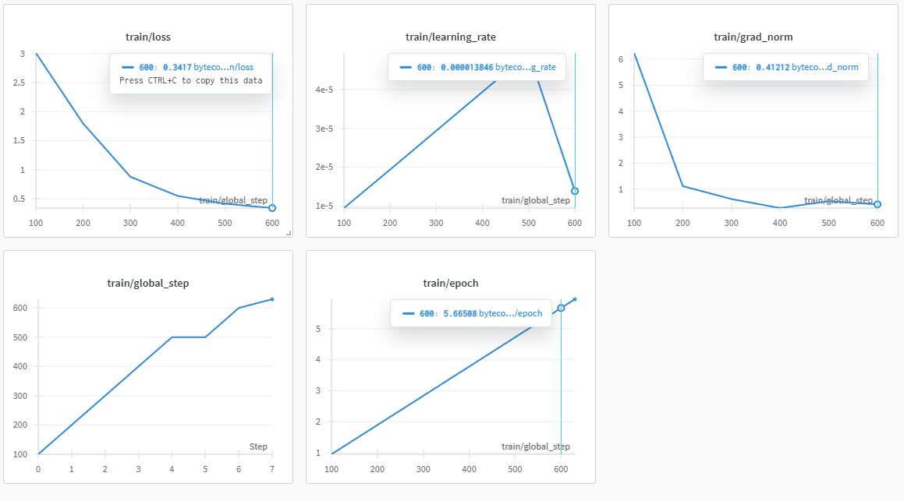
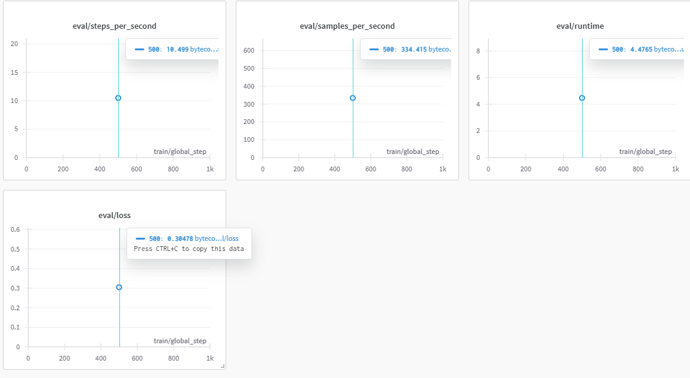

This still sucked tho, here's a sample:
```python
Original function:
def func_774(param_0, param_1, param_2):
    temp_46 = (((param_1 - param_1) - 60) * param_1)
    temp_42 = (param_2 / temp_46)
    temp_28 = (((temp_42 / temp_42) - temp_42) - 96)
    temp_69 = (((temp_42 - 18) / temp_28) + param_0)
    temp_88 = ((49 / temp_28) + temp_69)
    temp_88 = (((temp_88 * temp_42) / temp_69) - temp_88)
    temp_81 = (((65 - temp_88) - 70) + temp_88)
    temp_63 = (temp_88 - param_0)
    return (((temp_63 - temp_63) - 34) / 28)

Bytecode input:
RESUME 0 | LOAD_FAST param_1 | LOAD_FAST param_1 | BINARY_OP 10 | LOAD_CONST 60 | BINARY_OP 10 | LOAD_FAST param_1 | BINARY_OP 5 | STORE_FAST temp_46 | LOAD_FAST param_2 | LOAD_FAST temp_46 | BINARY_OP 11 | STORE_FAST temp_42 | LOAD_FAST temp_42 | LOAD_FAST temp_42 | BINARY_OP 11 | LOAD_FAST temp_42 | BINARY_OP 10 | LOAD_CONST 96 | BINARY_OP 10 | STORE_FAST temp_28 | LOAD_FAST temp_42 | LOAD_CONST 18 | BINARY_OP 10 | LOAD_FAST temp_28 | BINARY_OP 11 | LOAD_FAST param_0 | BINARY_OP 0 | STORE_FAST temp_69 | LOAD_CONST 49 | LOAD_FAST temp_28 | BINARY_OP 11 | LOAD_FAST temp_69 | BINARY_OP 0 | STORE_FAST temp_88 | LOAD_FAST temp_88 | LOAD_FAST temp_42 | BINARY_OP 5 | LOAD_FAST temp_69 | BINARY_OP 11 | LOAD_FAST temp_88 | BINARY_OP 10 | STORE_FAST temp_88 | LOAD_CONST 65 | LOAD_FAST temp_88 | BINARY_OP 10 | LOAD_CONST 70 | BINARY_OP 10 | LOAD_FAST temp_88 | BINARY_OP 0 | STORE_FAST temp_81 | LOAD_FAST temp_88 | LOAD_FAST param_0 | BINARY_OP 10 | STORE_FAST temp_63 | LOAD_FAST temp_63 | LOAD_FAST temp_63 | BINARY_OP 10 | LOAD_CONST 34 | BINARY_OP 10 | LOAD_CONST 28 | BINARY_OP 11 | RETURN_VALUE

Model output:
(param_1 + 60):
    temp_41 = ((param_1 / param_2)
    param_0 = ((temp_69 - temp_68) - temp_69)).
    temp_41 = ((((((temp_29 - temp_56) / temp_69) + 6)
    temp_88)
    temp_82 = ((temp_71 - param_3) + 2) ** 31)
    temp_56 = ((temp_47 - temp_67))
    temp_88 = (((39 - temp_41) / 90)
    temp_81 = (((temp_28) / temp_69) +temp_88 + temp_88) - temp_63) - temp_63) * temp_41)
    temp_88)
```

# hemm, so wat do nao

Atm it sucks, it really does, lol. Grammatical issues, validity, and limited ctx len. To be fair, I've only ran it for base once, and small twice, but the model has failed pretty spectacularly in doing the translation work that I was hoping for.

...Well, regardless, this post was really mostly on starting off the experiments, and the second post on this blog. So really, I wasn't looking on finding a bullseye immediately. Further explorations are pretty expanse here:
1. Look into using newer models, this isn't even codet5+ lol.
2. Look into decoder-only.
3. Look into frankenstein.

We'll go over these approaches in the next posts, I'll probably also retry this, three trials is just too small of a trial window.

Btw happy eid everiwan,  
infokan makan-makan le~   
– kek ♡

----